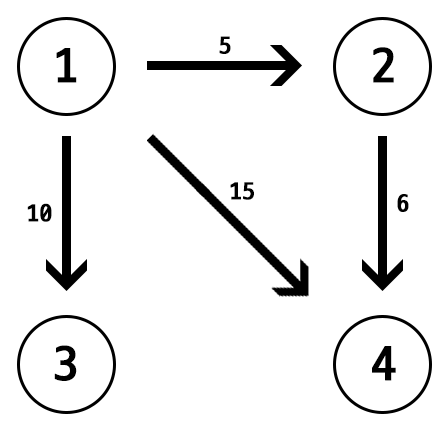
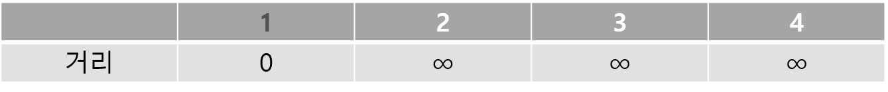
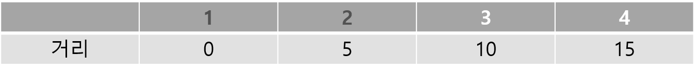
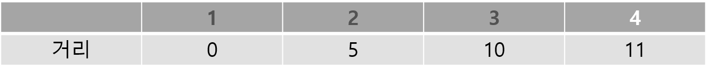
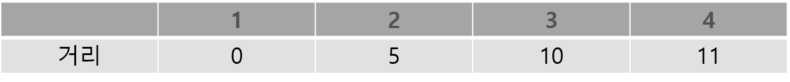

## 다익스트라 알고리즘
하나의 시작 정점에서 모든 정점 까지의 최단경로를 찾는 알고리즘이다

### 알고리즘 아이디어
1. 시작 정점의 거리는 0, 나머지 정점까지의 거리는 무한대로 지정
2. 아직 가지 않은 정점들 중 거리가 가장 짧은 정점을 선택
3. 그 정점으로 부터 갈 수 있는 정점들의 거리를 갱신한다(단 이미 있는 값 보다 길 경우 갱신하지 않는다)
4. 모든 정점의 거리가 확정 될 떄 까지 반복

거리를 저장하는 1차원 배열과 확정 됐는지를 확인하는 1차원 배열 하나만 있으면 되는 간단한 알고리즘이다

위와 같은 그래프가 있으며 시작 정점이 1번이라고 예시를 들어보자

그러면 우선 위와 같은 테이블을 하나 준비해야 할 것이다

방문한 정점은 편의를 위해 글의 색을 회색으로 칠했다

1번 정점으로 부터 갈 수 있는 2, 3, 4번 정점의 거리를 갱신해 주었다

이제 방문하지 않은 정점 중 2번 정점의 거리가 가장 짧으므로 2번 정점을 선택해준다

2번 정점으로 부터 갈 수 있는 4번 정점의 거리를 갱신해 주었는데 2번 정점으로 부터 4번 정점으로 가는 것이 기존 보다 짧으므로 갱신해주어야 한다

만약 기존 보다 더 길었다면 갱신해주면 안 된다

이제 남은 정점 중 가장 거리가 짧은 3번 정점을 선택

3번 정점에서 더 갈 수 있는 정점이 없으므로 갱신할 것이 없으며 남은 4번 정점을 선택

4번 정점까지 가면 모든 정점을 방문 했으니 테이블을 채우는 것은 끝났다

위 테이블이 1번 정점으로 부터 각 정점으로 가는 가장 짧은 경로가 되는 것이다

### 시간복잡도

단순히 배열에 거리를 저장해 각 단계마다 최단 길이를 찾는다면 최단 길이를 찾는 O(V)에 다시 각 정점까지의 거리를 찾는 O(V-1)이 이루어져 총 O(V^2)이라는 시간복잡도가 나온다

이럴 경우 정점의 갯수가 커질수록 시간도 더 오래 걸리기에 priority queue를 이용해 시간복잡도를 확 줄일 수 있다

각 정점을 방문할 때 마다 힙에 (dist[v],v)를 넣고 매 단계마다 queue에서는 가장 짧은 경로가 나올 것이다

그렇다면 각 정점마다 힙에서 최단 거리를 꺼내는 연산을 계산하면 O(ElogV)가 된다

### 구현

BOJ 1753 최단경로 문제를 priority queue를 이용해 구현한 코드이다
https://icpc.me/1753

~~~ cpp
#include <stdio.h>
#include <vector>
#include <queue>

#define M 300005
#define mk make_pair
#define MAX 1000000000

using namespace std;

vector <pair <int, int> >  edge[M];
priority_queue <pair <int, int>, vector <pair <int, int> >, greater <pair <int, int> > > pq;

int D[M];
bool chk[M];

int main() {
	int n, m, i, j, a, b, d, s, v, u;

	scanf("%d %d", &n, &m);
	scanf("%d", &s);

	for (i = 0; i < m; i++) {
		scanf("%d %d %d", &a, &b, &d);
		edge[a].push_back(mk(b, d));
	}

	for (i = 1; i <= n; i++) D[i] = MAX;
	D[s] = 0;

	pq.push(mk(0, s));

	while (!pq.empty()) {
		v = pq.top().second;
		pq.pop();

		if (chk[v]) continue;
		chk[v] = true;

		for (j = 0; j < edge[v].size(); j++) {
			u = edge[v][j].first;
			d = edge[v][j].second;

			if (D[u] > D[v] + d) {
				D[u] = D[v] + d;
				pq.push(mk(D[u], u));
			}
		}
	}

	for (i = 1; i <= n; i++) {
		if (D[i] == MAX) printf("INF\n");
		else printf("%d\n", D[i]);
	}

	return 0;
}
~~~
