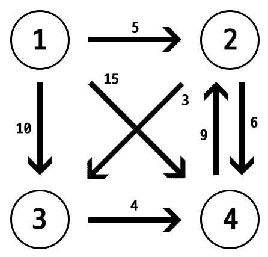
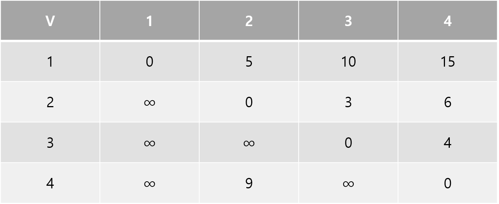
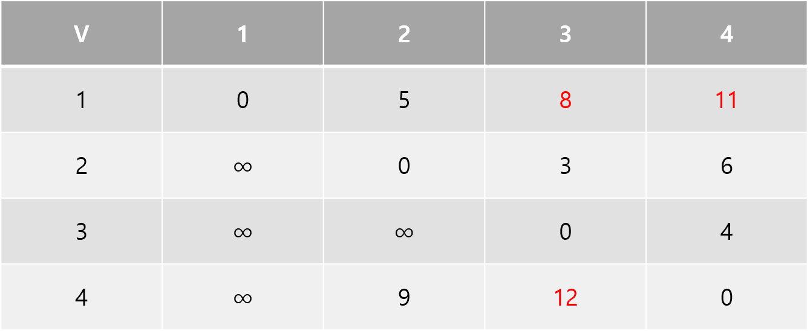
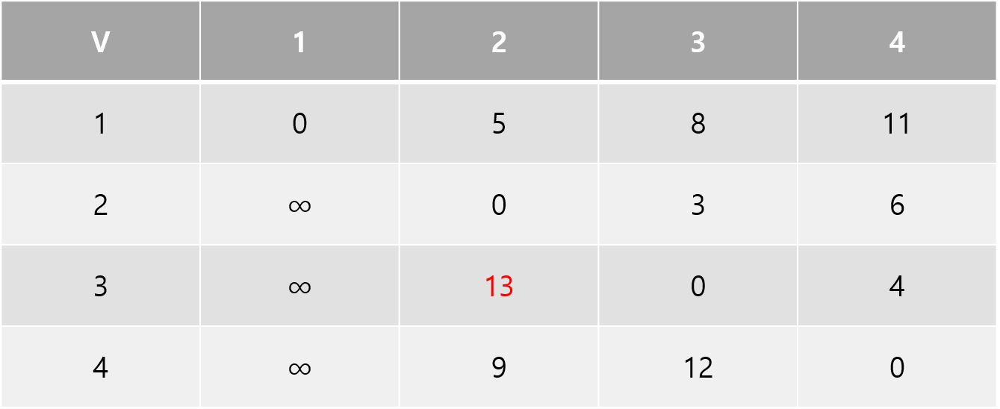

## 플로이드 와셜 알고리즘
모든 정점에서 모든 정점까지의 최단경로를 찾는 알고리즘이다

## 알고리즘 아이디어
한 정점에서 다른 정점까지 가는 도중 다른 정점을 거쳐 가는 것이 더 짧은지 확인한다

뭐라 설명할 것도 없이 매우 간단한 알고리즘이다

위와 같은 그래프가 있다고 해보자

기본 테이블은 이렇게 만들 수 있다

테이블의 각 요소를 min(d[i][j], d[i][k] + d[1][k])로 업데이트 해주면 된다

이때 i는 출발 정점, j는 도착 정점, k는 거쳐가는 정점이다

1번 정점을 통해 다른 정점으로 가는 방법은 1번 정점에서 출발하는 방법 밖에 없으니 테이블을 생략하겠다

2번 정점을 통해 다른 정점으로 가는 방법을 생각해보자

2번 정점을 거쳐 가면 1 -> 3, 1 -> 4, 4 -> 3의 최단 경로가 새로 만들어진다

3번 정점을 거쳐도 짧아지는 경로가 없으니 테이블은 생략하겠다

4번 정점을 거치면 3 -> 2로 가는 경로가 만들어진다

이렇게 모든 정점에서 모든 정점으로 가는 최단 경로가 저장된 테이블이 완성됐다

## 시간복잡도

복잡하게 생각할 것도 없이 i, j, k를 v만큼 반복하니 \\[O(V^{3})\\]라는 시간 복잡도가 나온다

다익스트라를 두고 이 알고리즘을 이용하는 이유는 모든 정점에서 모든 정점까지의 최단 경로를 구할 수 있을 뿐만 아니라 다익스트라는 간선의 가중치가 음수인 경우를 못 구하기 때문이다

아무리 그래도 시간복잡도가 매우 크니 정점의 갯수를 보고 잘 선택하도록 하자

## 구현

코드는 매우 간단하다

단 왜인진 모르겠지만 for문의 k, i, j 순서를 꼭 맞춰줘야 한다

p배열은 p[i][j]로 가는 길에 마지막으로 들린 정점으로 경로를 찾아야 할 경우를 위해 추가하였다

~~~ cpp
#define _CRT_SECURE_NO_WARNINGS
#include <cstdio>

#define INF 2e9
#define N 500

int d[N][N], p[N][N];

int main() {
	int n, m, i, j, k, a, b, c;

	for (i = 1; i <= n; i++) {
		if (i != j) d[i][j] = INF;
		if (i == j) p[i][j] = i;
	}

	scanf("%d %d", &n, &m);

	for (i = 1; i <= m; i++) {
		scanf("%d %d %d", &a, &b, &c);
		d[a][b] = c;
		p[a][b] = a;
	}

	for (k = 1; k <= n; k++) {
		for (i = 1; i <= n; i++) {
			for (j = 1; j <= n; j++) {
				if (d[i][j] > d[i][k] + d[k][j]) {
					d[i][j] = d[i][k] + d[k][j];
					p[i][j] = k;
				}
			}
		}
	}
	
	return 0;
}
~~~
