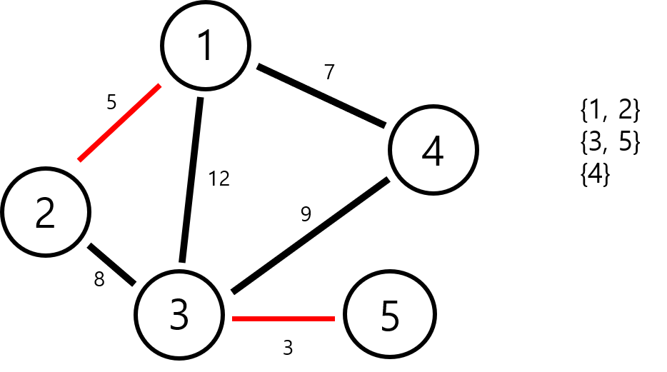
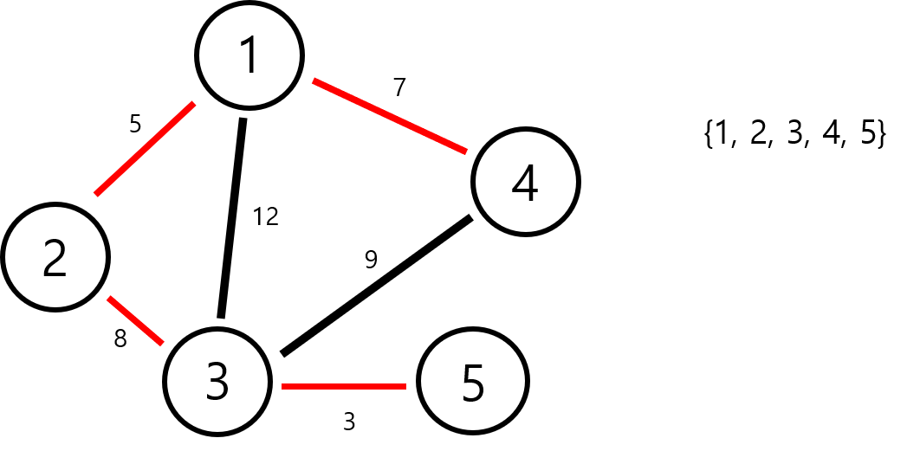

## 최소 신장 트리 알고리즘
가중치의 합이 제일 작은 Spanning Tree를 만드는 알고리즘이다

## 트리
트리는 N개의 노드와 N - 1개의 간선으로 이루어진 특별한 형태의 그래프이다

부모 노드와 그 아래 딸린 자식 노드들로 이루어져 있다

그리고 자식이 없는 노드를 leaf 노드라고 부른다

## 스패닝 트리 (Spanning Tree)

그래프의 최소 연결 부분 그래프이다

즉 N개의 노드와 N - 1개의간선으로 연결 된 그래프로 트리의 형태를 띄게 된다

이런 형태의 그래프가 있다고 하자

<figure class="half">
    
    
    <figcaption>스패닝 트리의 두가지 예시</figcaption>
</figure>

위와 같은 형태가 되면 스패닝 트리라고 한다

여기서 최소 스패닝 트리는 간선의 가중치의 합이 최소가 되는 스패닝 트리를 뜻한다

최소 신장 트리 알고리즘에는 Kruskal과 Prim이라는 2가지 방법이 있는데 이 포스트에서는 Kruskal방식을 알아 볼 것이다

## 서로소 집합 (Disjoint Set)

서로소 집합이란 겹치는 원소가 없는 집합들이다

이를 트리로 표현할 수 있으며 다음과 같은 그림이 나올 것이다

서로소 집합에서는 집합을 결합하는 union과 원소가 속한 집합을 찾는 find 연산이 가능하다

find 연산은 어떤 원소의 조상을 찾으면 된다

예를 들어 3은 1이 속한 집합에 속해있고 6은 5가 속한 집합에 속해있다

union연산은 한 집합의 조상을 다른 집합의 자식에 붙이면 된다

오른쪽 집합을 왼쪽 집합에 합치면 위와 같은 형태가 될 것이다

그런데 만약 트리가 다음과 같은 최악의 방법으로 표현된다면 leaf 노드의 조상을 찾기 위해서는 N - 1개의 노드를 거슬러 올라가야하는 비효율적인 상황이 발생한다

그리하여 find를 하면서 모든 자식 노드를 조상 노드의 바로 아래 자손으로 만드는 방법이 존재한다

~~~ cpp
int find(int v){
    if(parent[v] == -1) return v;
    return parent[v] = find(parent[v]);
}
~~~

find(4)를 한번 실행하면 위와 같은 예쁜 모양이 나올 것이다

## 알고리즘 아이디어

1. 간선들을 가중치 순서대로 정렬한다
2. 가중치가 가장 작은 간선부터 간선끼리 연결 된 정점들이 속해 있는 집합을 확인
3. 서로 다른 집합에 속해있다면 간선을 포함시키고 두 집합을 union, 같은 집합에 속해있다면 넘어간다
4. 모든 간선에 대해 위 과정을 수행

위 예시를 들어 처음부터 해보자

오른쪽은 원소가 속해있는 집합을 적어둔 것이다

1단계와 2단계를 수행하고 난 뒤의 모습이다

이제 다음으로 1번과 4번 정점을 잇는 간선을 연결 할 것인데 둘다 다른 집합에 속해 있으므로 연결을 해주어도 된다

마찬가지로 그 다음 단계인 2번과 3번 정점들도 다른 집합에 속해 있으니 간선 연결이 가능하다

가중치가 9인 간선과 12인 간선은 연결된 노드들이 같은 집합에 속해있으니 더 이상 연결할 수 없고 위와 같은 결과가 나오게 된다

## 시간복잡도

Kruskal 알고리즘은 간선을 정렬해야하므로 정렬 알고리즘에 따라 시간복잡도가 달라진다

퀵소트 알고리즘을 이용한다면 \\[O(Elog_{2}E)\\]만에 해결이 가능하다

## 구현

[BOJ 1197](https://icpc.me/1197)번 문제가 MST를 구현하는 문제이다

~~~ cpp
#define _CRT_SECURE_NO_WARNINGS
#include <stdio.h>
#include <algorithm>
#include <vector>

#define N 10005
#define mk make_pair

using namespace std;

typedef pair<int, int> p;
typedef pair<int, p> pp;

vector<pp> v;

int parent[N];

int find(int a) {
	if (parent[a] == -1) return a;
	return parent[a] = find(parent[a]);
}

void union(int a, int b) {
	int ap = find(a), bp = find(b);
	
	if (ap != bp) parent[bp] = ap;
}

int main() {
	int n, m, i, j, k, a, b, c, sum = 0;
	
	scanf("%d %d", &n, &m);

	for (i = 1; i <= n; i++) parent[i] = -1;

	for (i = 1; i <= m; i++) {
		scanf("%d %d %d", &a, &b, &c);
		v.push_back(mk(c, mk(a, b)));
	}

	sort(v.begin(), v.end());

	for (i = 0; i < v.size(); i++) {
		if (find(v[i].second.first) != find(v[i].second.second)) {
			sum += v[i].first;
			union(v[i].second.first, v[i].second.second);
		}
	}

	printf("%d\n", sum);

	return 0;
};
~~~
