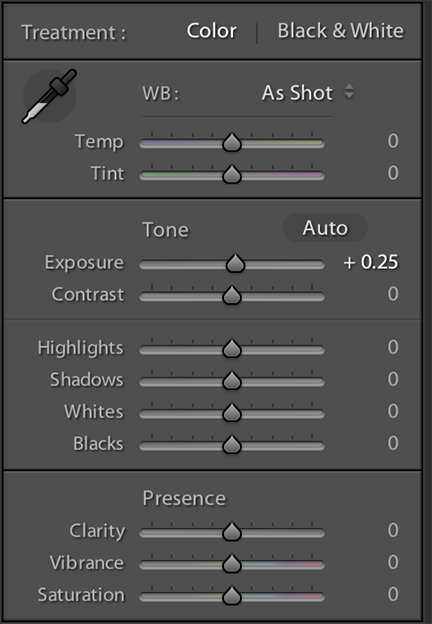
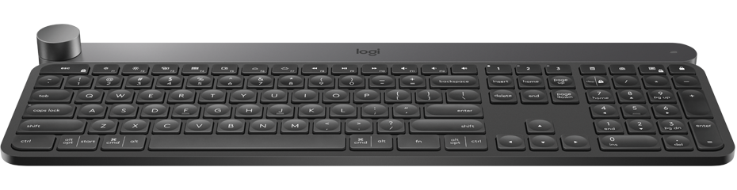
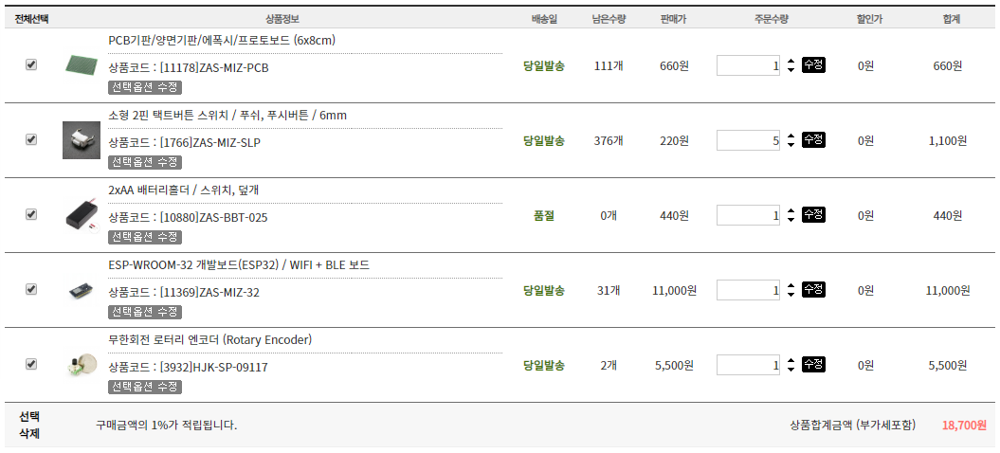

## Lightroom Wheel 프로젝트 계획 
평소에 사진을 찍을 때 빠질 수 없는 단계가 있는데 바로 라이트룸을 이용한 후보정이다.

(출처 : [어도비](https://helpx.adobe.com/lightroom-classic/kb/sliders-lightroom-all-white-look.html))

라이트룸을 사용하면 위의 슬라이더를 이용해서 보정값을 조절 하는데 마우스를 클릭한채로 움직이는게 생각보다 힘들다.

세밀한 조절이 힘들뿐더러 클릭한채로 드래그를 해야하니 손목에도 무리가 조금씩 오곤 한다.

그러던 중 "로지텍 크래프트" 제품을 보았는데 상당히 괜찮아 보였지만 가격은 상당히 괜찮지 않았다.

(출처 : [로지텍](https://www.logitech.com/ko-kr/product/craft))

대충 이렇게 생긴 물건인데 단지 휠 하나 달렸다고 기계식 키보드도 아닌 주제에 20만원씩이나 한다.

저 휠을 돌려서 라이트룸 뿐만 아니라 여러 프로그램에서 사용 가능하다고 하는데 나는 라이트룸에서만 필요해 저 비싼걸 사기는 돈이 아까워서 그냥 휠만 만들어보기로 했다.

대충 필요한 것들을 생각해서 메카솔루션 장바구니에 담아 봤는데 2만원 선에서 해결이 가능할 것 같다.

물론 삽질 하다가 부품을 날려먹지 않는 한 말이다.

목표는 아두이노와 블루투스 모듈을 이용해서 단축키 입력 값을 컴퓨터로 보낼 생각이고 로터리 엔코더를 이용해 라이트룸 슬라이드를 조절, 푸쉬 버튼을 이용해 선택 슬라이더를 이동할 생각이다.

원래 아두이노 나노에 HC-05 같은 걸 붙일 생각이었는데 찾아보니까 ESP32라고 블루투스와 와이파이 모듈이 포함된 중국에서 나온 보드가 요즘 인기 있길래 이걸로 바꾸기로 했다.

근데 배터리 홀더가 품절이라... 전화 해보니 이번주 금요일이나 다음주 월요일에 입고된다니 아마 다음주부터 본격적인 개발이 시작되지 않을까 싶다.  
