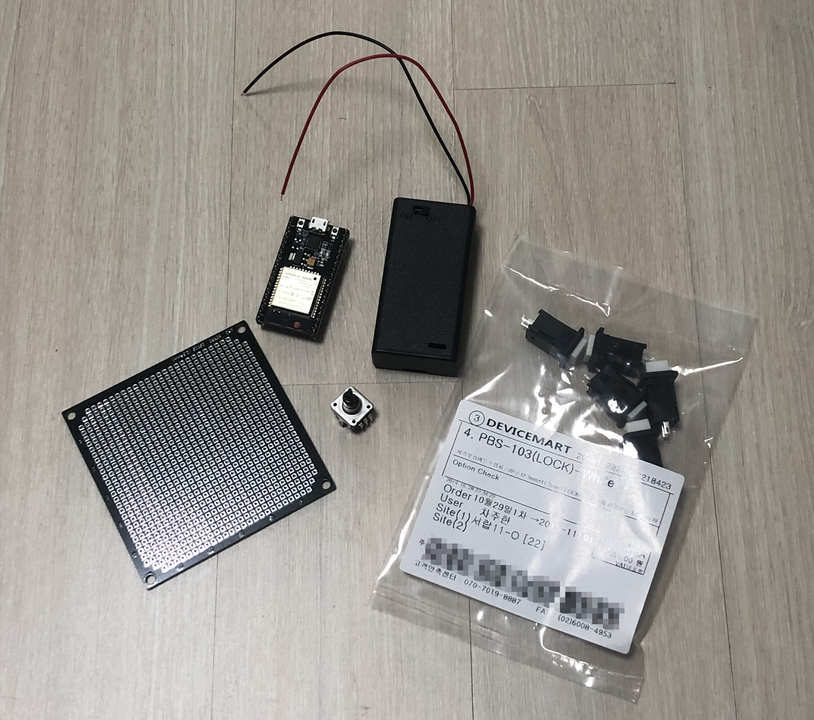
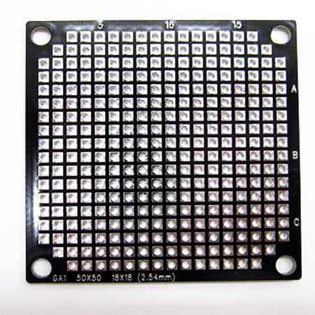
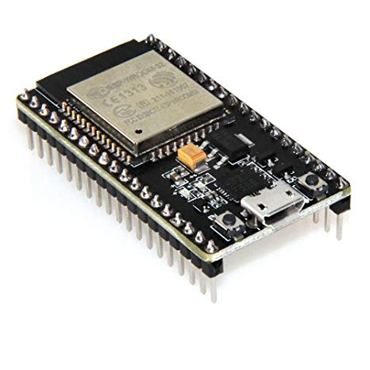
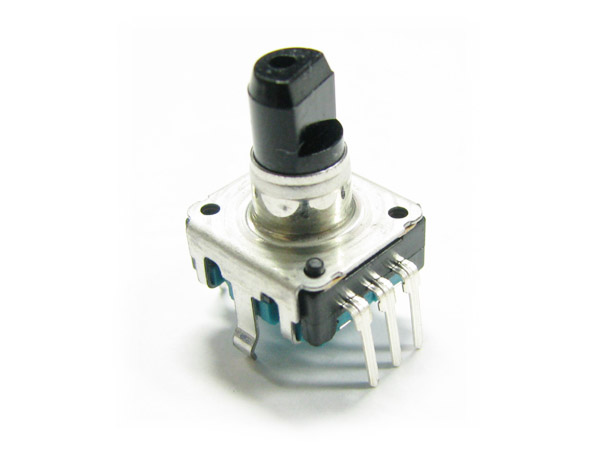

## Lightroom Wheel 프로그래밍
메카솔루션은 다음주나 돼야 배송을 할 거 같아서 천원정도 더 주고 디바이스 마트에서 재료들을 구입했다.

그리고 이 모지리는 푸쉬버튼을 사야되는데 다른걸 샀다.

따지고보면 푸쉬버튼이 맞기는 한데 락 기능이 있는 푸쉬버튼이라...

푸쉬버튼만 따로 인터넷에서 사면 배송비가 더 나올게 분명하니까 세운상가를 한 번 가든지 해야겠다.

(출처 : [엘레파츠](https://eleparts.co.kr/goods/view?no=14662))

제일 왼쪽은 만능기판으로 선만 주렁주렁 달아서 만들 순 없고 그렇다고 PCB를 만들수도 없어서 하나 샀다.

역시 초록색보다는 검은색이 이쁘긴 이쁘다.

(출처 : [아마존](https://www.amazon.com/HiLetgo-ESP-WROOM-32-Development-Microcontroller-Integrated/dp/B0718T232Z))

그 오른쪽은 이번에 사용할 MCU인데 앞서 말 했듯이 아두이노 대신 ESP32란 놈을 써보기로 했다.

프로그래밍 하다가 알게된 사실인데 아두이노에 HC-05 붙이면 HID 규격을 지원 안해서 블루투스 키보드로 못 쓴다고 한다.

그냥 신기해 보여서 ESP32를 샀는데 얘는 HID 규격을 지원한다고 하더라.

근데 핀맵이 아두이노처럼 정렬돼 있는게 아니고 14번 옆에 12번 그 옆에 13번 이런식으로 중구난방이라 핀 번호 찾는게 조금 힘들다.

(출처 : [MCU보드닷컴](https://www.mcuboard.com:14063/shop/goods/goods_view.php?goodsno=26996&category=013003008))

또 다른 주요부품인 로터리 엔코더이다.

라디오 볼륨 조절 다이얼 같은데 들어가는 부품으로 두 펄스 차이를 이용해 회전 방향이랑 회전 각도를 알 수 있다.(고 하는데 원리는 잘 모르겠다)

이 로터리는 5핀짜리인데 오른쪽에 3개는 회전각도를 계산하는데 필요하고 왼쪽에 안보이는 두개는 푸쉬버튼과 동일하게 작동한다.

어떤거는 각도 제한이 있는데 무한회전 로터리가 필요하니 잘 보고 사도록 하자.

우선 로터리 엔코더부터 작업을 시작했다.

소스코드 접기/펼치기

~~~ cpp
#include "driver/pcnt.h"

#define ENCODER_PIN_A   GPIO_NUM_13
#define ENCODER_PIN_B   GPIO_NUM_14

#define PULSE_COUNT_UNIT      PCNT_UNIT_0

int16_t theCounter = 0;

static void initPulseCounter(void)
{
    pcnt_config_t pcnt_config = {
        ENCODER_PIN_A,
        ENCODER_PIN_B,
        PCNT_MODE_KEEP,
        PCNT_MODE_REVERSE,
        PCNT_COUNT_INC,
        PCNT_COUNT_DIS,
        PULSE_COUNT_UNIT,
        PCNT_CHANNEL_0
    };
    
    /* Initialize PCNT unit */
    pcnt_unit_config(&pcnt_config);

    /* Configure and enable the input filter */
    pcnt_set_filter_value(PULSE_COUNT_UNIT, 1023); 
    pcnt_filter_enable(PULSE_COUNT_UNIT);

    /* Initialize PCNT's counter */
    pcnt_counter_pause(PULSE_COUNT_UNIT);
    pcnt_counter_clear(PULSE_COUNT_UNIT);

    /* Everything is set up, now go to counting */
    pcnt_counter_resume(PULSE_COUNT_UNIT);
}
void setup()
{
    Serial.begin(115200);
    Serial.printf("Counter: %d\n", theCounter);
    initPulseCounter();
}
void loop()
{
  int16_t thisCount;
  pcnt_get_counter_value(PULSE_COUNT_UNIT, &thisCount);
  if(thisCount!=theCounter)
  {
    theCounter=thisCount;
    Serial.printf("Counter: %d\n", theCounter);
  }
}
~~~

소스코드는 [여기](https://esp32.com/viewtopic.php?t=8473)에서 찾을 수 있었다.

아두이노에서 사용하는 엔코더 소스코드는 더 간단했는데 이상하게 그대로 ESP32에 올리니까 작동을 안해서 찾아보니까 더 복잡하지만 확실히 작동하는 소스코드가 존재했었다.

펄스파를 계산하는 부분은 잘 모르겠지만 일정한 각도만큼 회전할 때 마다 thisCount가 바껴서 theCounter와 비교를 통해 어디로 얼만큼 회전했는지를 알 수 있다.

소스코드 접기/펼치기

~~~ cpp
#include <BLEDevice.h>
#include <BLEUtils.h>
#include <BLEServer.h>
#include "BLE2902.h"
#include "BLEHIDDevice.h"
#include "HIDTypes.h"
#include "HIDKeyboardTypes.h"
#include <driver/adc.h>

BLEHIDDevice* hid;
BLECharacteristic* input;
BLECharacteristic* output;

bool connected = false;

class MyCallbacks : public BLEServerCallbacks {
  void onConnect(BLEServer* pServer){
    connected = true;
    BLE2902* desc = (BLE2902*)input->getDescriptorByUUID(BLEUUID((uint16_t)0x2902));
    desc->setNotifications(true);
  }

  void onDisconnect(BLEServer* pServer){
    connected = false;
    BLE2902* desc = (BLE2902*)input->getDescriptorByUUID(BLEUUID((uint16_t)0x2902));
    desc->setNotifications(false);
  }
};

/*
 * This callback is connect with output report. In keyboard output report report special keys changes, like CAPSLOCK, NUMLOCK
 * We can add digital pins with LED to show status
 * bit 0 - NUM LOCK
 * bit 1 - CAPS LOCK
 * bit 2 - SCROLL LOCK
 */
class MyOutputCallbacks : public BLECharacteristicCallbacks {
  void onWrite(BLECharacteristic* me){
    uint8_t* value = (uint8_t*)(me->getValue().c_str());
    ESP_LOGI(LOG_TAG, "special keys: %d", *value);
  }
};

void _taskServer(){
  BLEDevice::init("ESP32-keyboard");
  BLEServer *pServer = BLEDevice::createServer();
  pServer->setCallbacks(new MyCallbacks());

  hid = new BLEHIDDevice(pServer);
  input = hid->inputReport(1); // <-- input REPORTID from report map
  output = hid->outputReport(1); // <-- output REPORTID from report map

  output->setCallbacks(new MyOutputCallbacks());

  std::string name = "chegewara";
  hid->manufacturer()->setValue(name);

  hid->pnp(0x02, 0xe502, 0xa111, 0x0210);
  hid->hidInfo(0x00,0x02);

  BLESecurity *pSecurity = new BLESecurity();
//  pSecurity->setKeySize();
  pSecurity->setAuthenticationMode(ESP_LE_AUTH_BOND);

  const uint8_t report[] = {
    USAGE_PAGE(1),      0x01,       // Generic Desktop Ctrls
    USAGE(1),           0x06,       // Keyboard
    COLLECTION(1),      0x01,       // Application
    REPORT_ID(1),       0x01,        //   Report ID (1)
    USAGE_PAGE(1),      0x07,       //   Kbrd/Keypad
    USAGE_MINIMUM(1),   0xE0,
    USAGE_MAXIMUM(1),   0xE7,
    LOGICAL_MINIMUM(1), 0x00,
    LOGICAL_MAXIMUM(1), 0x01,
    REPORT_SIZE(1),     0x01,       //   1 byte (Modifier)
    REPORT_COUNT(1),    0x08,
    HIDINPUT(1),           0x02,       //   Data,Var,Abs,No Wrap,Linear,Preferred State,No Null Position
    REPORT_COUNT(1),    0x01,       //   1 byte (Reserved)
    REPORT_SIZE(1),     0x08,
    HIDINPUT(1),           0x01,       //   Const,Array,Abs,No Wrap,Linear,Preferred State,No Null Position
    REPORT_COUNT(1),    0x06,       //   6 bytes (Keys)
    REPORT_SIZE(1),     0x08,
    LOGICAL_MINIMUM(1), 0x00,
    LOGICAL_MAXIMUM(1), 0x65,       //   101 keys
    USAGE_MINIMUM(1),   0x00,
    USAGE_MAXIMUM(1),   0x65,
    HIDINPUT(1),           0x00,       //   Data,Array,Abs,No Wrap,Linear,Preferred State,No Null Position
    REPORT_COUNT(1),    0x05,       //   5 bits (Num lock, Caps lock, Scroll lock, Compose, Kana)
    REPORT_SIZE(1),     0x01,
    USAGE_PAGE(1),      0x08,       //   LEDs
    USAGE_MINIMUM(1),   0x01,       //   Num Lock
    USAGE_MAXIMUM(1),   0x05,       //   Kana
    HIDOUTPUT(1),          0x02,       //   Data,Var,Abs,No Wrap,Linear,Preferred State,No Null Position,Non-volatile
    REPORT_COUNT(1),    0x01,       //   3 bits (Padding)
    REPORT_SIZE(1),     0x03,
    HIDOUTPUT(1),          0x01,       //   Const,Array,Abs,No Wrap,Linear,Preferred State,No Null Position,Non-volatile
    END_COLLECTION(0)
  };

  hid->reportMap((uint8_t*)report, sizeof(report));
  hid->startServices();

  BLEAdvertising *pAdvertising = pServer->getAdvertising();
  pAdvertising->setAppearance(HID_KEYBOARD);
  pAdvertising->addServiceUUID(hid->hidService()->getUUID());
  pAdvertising->start();
  hid->setBatteryLevel(7);

  ESP_LOGD(LOG_TAG, "Advertising started!");
  //delay(portMAX_DELAY);

};

void setup() {
  Serial.begin(115200);
  Serial.println("Starting BLE work!");
  _taskServer();
  
  //xTaskCreate(taskServer, "server", 20000, NULL, 5, NULL);
}

char message[2];

void loop() {
  if(Serial.available()){
    char ch = Serial.read();
    if(connected == true){
      KEYMAP map = keymap[(uint8_t) ch];
      uint8_t msg[] = {map.modifier, 0x0, map.usage, 0x0, 0x0, 0x0, 0x0, 0x0};
      input->setValue(msg, sizeof(msg));
      input->notify();
      delay(15);
      uint8_t msg1[] = {0x0, 0x0, 0x0, 0x0, 0x0, 0x0, 0x0, 0x0};
      input->setValue(msg1, sizeof(msg1));
      input->notify();
      delay(15);
    }
  }
  
}
~~~

이 소스코드는 [여기](https://cafe.naver.com/kpopenproject/388)에 있는 첨부파일에서 찾을 수 있었다.

이 소스코드를 찾느라 꽤나 고생했는데 신기하게도 외국에도 ESP32 HID규격 키보드 입력과 관련된 제대로 된 자료를 찾을 수 없었는데 네이버의 어느 카페에 자료가 존재했었다.

이 코드를 모두 이해할 수는 없지만 대충 "KEYMAP" 부분을 통해 어떤 키를 입력할지 정하고 이를 "msg[]"배열에 담아서 "input->setValue()"를 통해 전송하는 것 같다.

위 코드는 시리얼 창에 적은 글을 ESP32와 연결된 기기에 작성하는 코드이다.

위 두 코드를 적절히 조합해서 아래와 같은 코드를 만들 수 있었다. 

소스코드 접기/펼치기

~~~ cpp
#include <BLEDevice.h>
#include <BLEUtils.h>
#include <BLEServer.h>
#include "BLE2902.h"
#include "BLEHIDDevice.h"
#include "HIDTypes.h"
#include "HIDKeyboardTypes.h"
#include <driver/adc.h>
#include "driver/pcnt.h"

#define ENCODER_PIN_A GPIO_NUM_13
#define ENCODER_PIN_B GPIO_NUM_14

#define PULSE_COUNT_UNIT PCNT_UNIT_0

#define ctrl_z GPIO_NUM_15

int16_t theCounter = 0;

static void initPulseCounter(void){
  pcnt_config_t pcnt_config = {
    ENCODER_PIN_A,
    ENCODER_PIN_B,
    PCNT_MODE_KEEP,
    PCNT_MODE_REVERSE,
    PCNT_COUNT_INC,
    PCNT_COUNT_DIS,
    PULSE_COUNT_UNIT,
    PCNT_CHANNEL_0
  };

  /* Initialize PCNT unit */
    pcnt_unit_config(&pcnt_config);

    /* Configure and enable the input filter */
    pcnt_set_filter_value(PULSE_COUNT_UNIT, 1023); 
    pcnt_filter_enable(PULSE_COUNT_UNIT);

    /* Initialize PCNT's counter */
    pcnt_counter_pause(PULSE_COUNT_UNIT);
    pcnt_counter_clear(PULSE_COUNT_UNIT);

    /* Everything is set up, now go to counting */
    pcnt_counter_resume(PULSE_COUNT_UNIT);
}

BLEHIDDevice* hid;
BLECharacteristic* input;
BLECharacteristic* output;

bool connected = false;

class MyCallbacks : public BLEServerCallbacks {
  void onConnect(BLEServer* pServer){
    connected = true;
    BLE2902* desc = (BLE2902*)input->getDescriptorByUUID(BLEUUID((uint16_t)0x2902));
    desc->setNotifications(true);
  }

  void onDisconnect(BLEServer* pServer){
    connected = false;
    BLE2902* desc = (BLE2902*)input->getDescriptorByUUID(BLEUUID((uint16_t)0x2902));
    desc->setNotifications(false);
  }
};

/*
 * This callback is connect with output report. In keyboard output report report special keys changes, like CAPSLOCK, NUMLOCK
 * We can add digital pins with LED to show status
 * bit 0 - NUM LOCK
 * bit 1 - CAPS LOCK
 * bit 2 - SCROLL LOCK
 */
class MyOutputCallbacks : public BLECharacteristicCallbacks {
  void onWrite(BLECharacteristic* me){
    uint8_t* value = (uint8_t*)(me->getValue().c_str());
    ESP_LOGI(LOG_TAG, "special keys: %d", *value);
  }
};

void _taskServer(){
  BLEDevice::init("Lightroom Wheel");
  BLEServer *pServer = BLEDevice::createServer();
  pServer->setCallbacks(new MyCallbacks());

  hid = new BLEHIDDevice(pServer);
  input = hid->inputReport(1); // <-- input REPORTID from report map
  output = hid->outputReport(1); // <-- output REPORTID from report map

  output->setCallbacks(new MyOutputCallbacks());

  std::string name = "JuHan Cha==-===-=======-====";
  hid->manufacturer()->setValue(name);

  hid->pnp(0x02, 0xe502, 0xa111, 0x0210);
  hid->hidInfo(0x00,0x02);

  BLESecurity *pSecurity = new BLESecurity();
//  pSecurity->setKeySize();
  pSecurity->setAuthenticationMode(ESP_LE_AUTH_BOND);

  const uint8_t report[] = {
    USAGE_PAGE(1),      0x01,       // Generic Desktop Ctrls
    USAGE(1),           0x06,       // Keyboard
    COLLECTION(1),      0x01,       // Application
    REPORT_ID(1),       0x01,        //   Report ID (1)
    USAGE_PAGE(1),      0x07,       //   Kbrd/Keypad
    USAGE_MINIMUM(1),   0xE0,
    USAGE_MAXIMUM(1),   0xE7,
    LOGICAL_MINIMUM(1), 0x00,
    LOGICAL_MAXIMUM(1), 0x01,
    REPORT_SIZE(1),     0x01,       //   1 byte (Modifier)
    REPORT_COUNT(1),    0x08,
    HIDINPUT(1),           0x02,       //   Data,Var,Abs,No Wrap,Linear,Preferred State,No Null Position
    REPORT_COUNT(1),    0x01,       //   1 byte (Reserved)
    REPORT_SIZE(1),     0x08,
    HIDINPUT(1),           0x01,       //   Const,Array,Abs,No Wrap,Linear,Preferred State,No Null Position
    REPORT_COUNT(1),    0x06,       //   6 bytes (Keys)
    REPORT_SIZE(1),     0x08,
    LOGICAL_MINIMUM(1), 0x00,
    LOGICAL_MAXIMUM(1), 0x65,       //   101 keys
    USAGE_MINIMUM(1),   0x00,
    USAGE_MAXIMUM(1),   0x65,
    HIDINPUT(1),           0x00,       //   Data,Array,Abs,No Wrap,Linear,Preferred State,No Null Position
    REPORT_COUNT(1),    0x05,       //   5 bits (Num lock, Caps lock, Scroll lock, Compose, Kana)
    REPORT_SIZE(1),     0x01,
    USAGE_PAGE(1),      0x08,       //   LEDs
    USAGE_MINIMUM(1),   0x01,       //   Num Lock
    USAGE_MAXIMUM(1),   0x05,       //   Kana
    HIDOUTPUT(1),          0x02,       //   Data,Var,Abs,No Wrap,Linear,Preferred State,No Null Position,Non-volatile
    REPORT_COUNT(1),    0x01,       //   3 bits (Padding)
    REPORT_SIZE(1),     0x03,
    HIDOUTPUT(1),          0x01,       //   Const,Array,Abs,No Wrap,Linear,Preferred State,No Null Position,Non-volatile
    END_COLLECTION(0)
  };

  hid->reportMap((uint8_t*)report, sizeof(report));
  hid->startServices();

  BLEAdvertising *pAdvertising = pServer->getAdvertising();
  pAdvertising->setAppearance(HID_KEYBOARD);
  pAdvertising->addServiceUUID(hid->hidService()->getUUID());
  pAdvertising->start();

  ESP_LOGD(LOG_TAG, "Advertising started!");
  //delay(portMAX_DELAY);

};

void setup() {
  Serial.begin(115200);
  Serial.println("Starting BLE work!");
  _taskServer();

  Serial.printf("Counter: %d\n", theCounter);
  initPulseCounter();

  pinMode(ctrl_z, INPUT_PULLUP);
}

void loop() {
  int16_t thisCount;
  pcnt_get_counter_value(PULSE_COUNT_UNIT, &thisCount);

  int ctrl_z_state = digitalRead(ctrl_z);
  
  if(thisCount > theCounter){
    theCounter = thisCount;
    Serial.printf("CW Counter: %d\n", theCounter);
    if(connected == true){
      KEYMAP map = {0x2e, 0};
      uint8_t msg[] = {map.modifier, 0x0, map.usage, 0x0, 0x0, 0x0, 0x0, 0x0};
      input->setValue(msg, sizeof(msg));
      input->notify();
    }
    delay(50);
  }

  if(thisCount < theCounter){
    theCounter = thisCount;
    Serial.printf("CCW Counter: %d\n", theCounter);
    if(connected == true){
      KEYMAP map = {0x2d, 0};
      uint8_t msg[] = {map.modifier, 0x0, map.usage, 0x0, 0x0, 0x0, 0x0, 0x0};
      input->setValue(msg, sizeof(msg));
      input->notify();
    }
    delay(50);
  }

  if(ctrl_z_state == LOW){
    Serial.println("Ctrl Z");
    if(connected = true){
      KEYMAP map = {0x1d, KEY_CTRL};
      uint8_t msg[] = {map.modifier, 0x0, map.usage, 0x0, 0x0, 0x0, 0x0, 0x0};
      input->setValue(msg, sizeof(msg));
      input->notify();
    }
    delay(100);
  }

  if(thisCount == theCounter && ctrl_z_state == HIGH){
    if(connected == true){
      uint8_t msg[] = {0x0, 0x0, 0x0, 0x0, 0x0, 0x0, 0x0, 0x0};
      input->setValue(msg, sizeof(msg));
      input->notify();
    }
    delay(100);
  }
  
}
~~~

라이트룸에서는 '='랑 '-'키를 슬라이더 조절 단축키로 사용하므로 이에 맞는 키 입력 코드로 바꿔서 작성했다.

그리고 잘 못 산 푸쉬버튼을 새로 구해서 슬라이더 위아래 이동 용 버튼으로 넣을 생각인데 로터리에 남은 푸쉬버튼에 뭘 넣을까 생각하다가 실행취소 단축키를 넣어주었다.

<iframe src='https://www.youtube.com/embed/uq-14FJmLGU' frameborder='0' allowfullscreen></iframe>

위 코드를 업로드 하면 영상과 같이 라이트룸에서 사용가능하다.

남은 일은 푸쉬버튼을 사와서 코드를 추가한 다음 만능 기판에 회로를 짜고 3D 프린터로 외관을 덮는 일만 남았다.

학교에 있는 메이커 스페이스에 목재 필라멘트가 있으면 좋을텐데...
