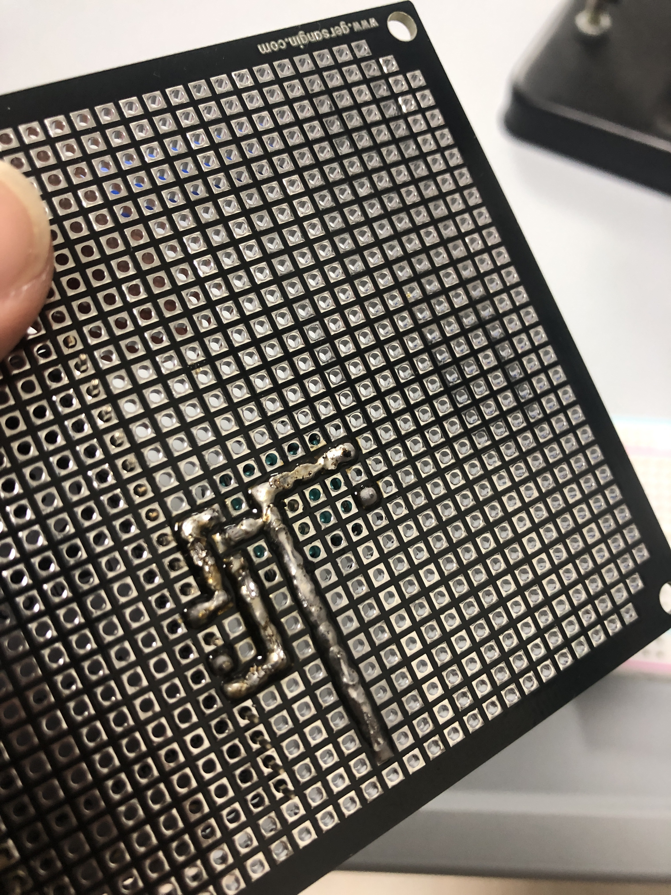
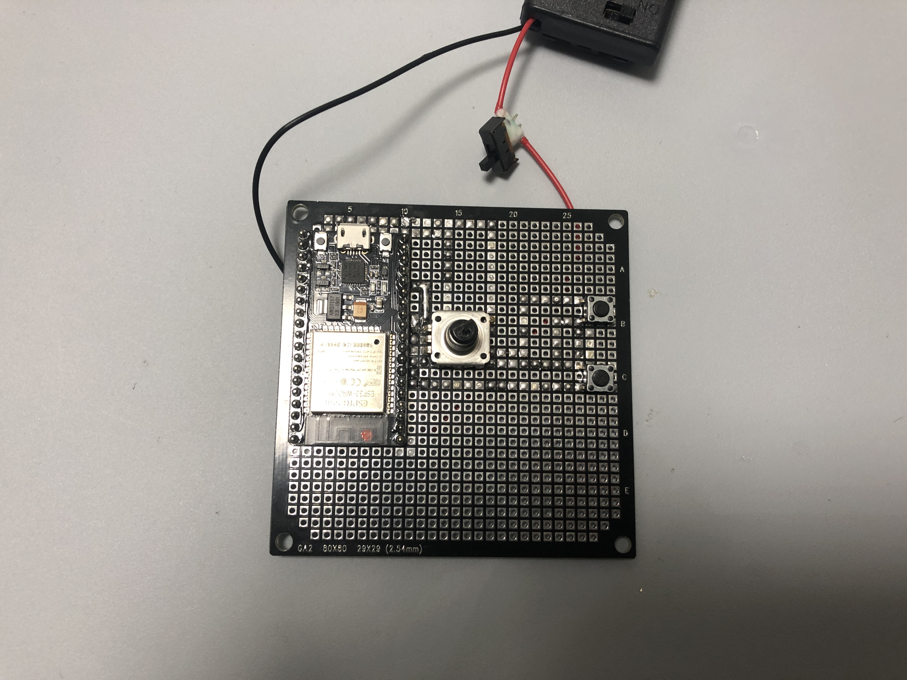
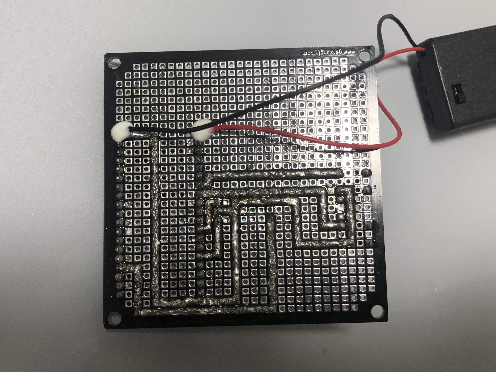

## Lightroom Wheel 회로 제작
학교에서 세운상가까지 자전거 타고 20분 밖에 안 걸린다길래 수업 끝나고 따릉이를 빌려서 세운상가를 갔다.

6시 쯤에 도착했는데 다행히 대부분 가게는 영업 중이었고 아무데나 들어가서 푸쉬버튼 5개랑 슬라이드 스위치 2개 빵판 1개를 사왔다.

집에 와서 푸쉬버튼이 제대로 작동하는지 확인하고 라이트룸에서 슬라이더 이동 단축키인 ','와 '.'키를 할당해줬다.

~~~ cpp
int up_state = digitalRead(UP);
int down_state = digitalRead(DOWN);

if(up_state == LOW){
    Serial.println("UP");
    if(connected == true){
      KEYMAP map = {0x36, 0};
      uint8_t msg[] = {map.modifier, 0x0, map.usage, 0x0, 0x0, 0x0 ,0x0 ,0x0};
      input->setValue(msg, sizeof(msg));
      input->notify();
    }
    delay(100);
  }

  if(down_state == LOW){
    Serial.println("DOWN");
    if(connected == true){
      KEYMAP map = {0x37, 0};
      uint8_t msg[] = {map.modifier, 0x0, map.usage, 0x0, 0x0, 0x0, 0x0, 0x0};
      input->setValue(msg, sizeof(msg));
      input->notify();
    }
    delay(100);
  }
~~~

모든 소스코드가 완성됐으니 이제 회로를 구성하면 되는데 이게 정말 힘들었다.

이런식으로 만능기판에 부품을 꽂고 뒷 부분을 납을 이용해 선을 만들어 핀과 핀을 연결하면 되는데 이 과정이 그냥 말 그대로 육체노동이다.

회로를 만들면서 선끼리 교차하지 않게 생각해야하고 납이 옆 칸으로 넘어가서 다른 선이랑 닿지 않게도 하는 등 여튼 꽤나 힘든 작업이었다.

그냥 핀을 홀에 넣고 고정용으로 납땜하는건 이제 할만한데 선 긋는건 처음이라 엄청 헤맸다.

3 ~ 4시간 정도 걸렸나? 부품 하나 붙이고 작동 확인하고 하나 붙이고 확인하고 하다보니 어느새 회로 구성이 끝났다.

ESP32 입력 전원이 2.2V - 3.6V이기는 하지만 AA 두 개로 부족하면 어떡하지 걱정이 되긴 했었다.

그래도 다행히 전원이 들어오고 블루투스도 잘 작동했다.

배터리 홀더는 뚜껑이 있는 제품인데 열리는 반대쪽에 전원 스위치가 있길래 뚜껑이 달리는 쪽에 스위치를 달기 위해 스위치를 추가로 달아줬다.

뒷면은 이런 상태인데 그라운드가 엄청 멀리 가는 걸 볼 수 있다.

사실은 13번 핀 바로 옆이 그라운드여서 저렇게 멀리 안 보내도 되는데 실수로 로터리 엔코더를 ESP32랑 한 줄만 간격을 줘서 13번 핀 옆의 그라운드를 연결 할 수 없었다.

이것만 똑바로 했으면 30분은 더 빨리 끝낼 수 있었을텐데 오늘도 이 모지리는 삽질을 또 했다.

전선은 나중에 납땜이 안 되어 있는 부분이 끊어질까봐 목공풀로 피복 일부까지해서 고정시켰다.

<iframe src='https://www.youtube.com/embed//8En8lx7DmyY' frameborder='0' allowfullscreen></iframe>

다행히 모든게 정상 작동한다.

이제 외관 틀만 만들어주면 되는데 이건 언제하지...
