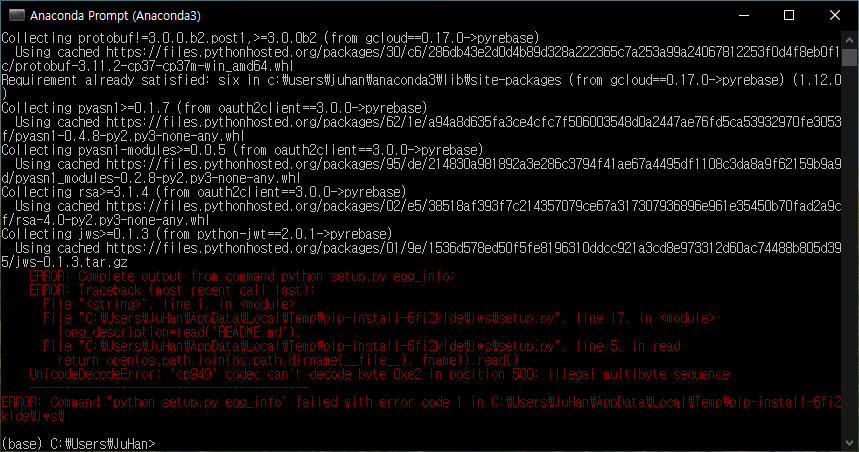
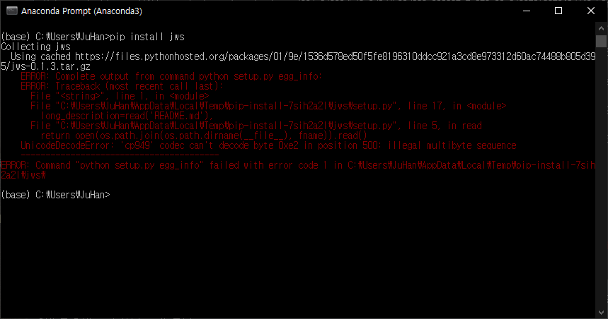
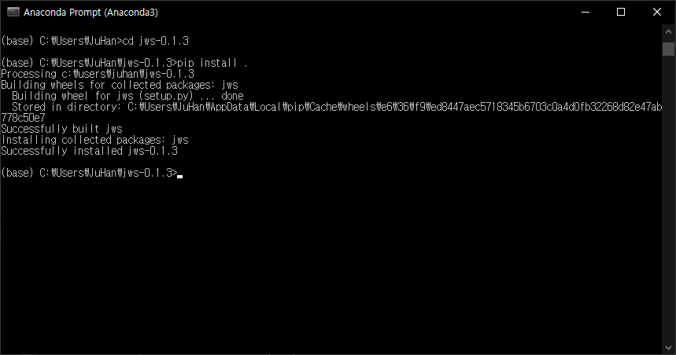
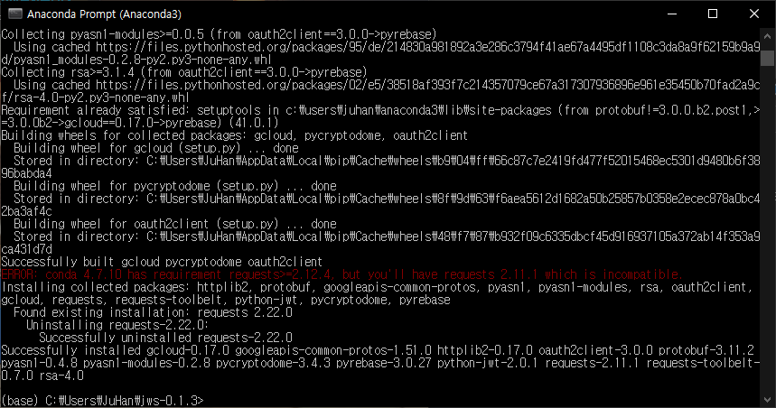

## PIP install시 UnicoeDecodeError

파이썬과 파이어베이스를 이용한 데스크탑 프로그램을 하나 제작하기 시작했다.

그런데 파이썬에서 파이어베이스 authentication 기능을 사용하기 위해 pyrebase 패키지를 설치하려고 했는데 오류가 발생했다.

이게 특정 언어의 윈도우에서 발생한다고 하는 것 같다.

~~~
ERROR: Complete output from command python setup.py egg_info:
ERROR: Traceback (most recent call last):
  File "<string>", line 1, in <module>
  File "C:\Users\JuHan\AppData\Local\Temp\pip-install-6fi2klde\jws\setup.py", line 17, in <module>
    long_description=read('README.md'),
  File "C:\Users\JuHan\AppData\Local\Temp\pip-install-6fi2klde\jws\setup.py", line 5, in read
    return open(os.path.join(os.path.dirname(__file__), fname)).read()
UnicodeDecodeError: 'cp949' codec can't decode byte 0xe2 in position 500: illegal multibyte sequence
----------------------------------------
ERROR: Command "python setup.py egg_info" failed with error code 1 in C:\Users\JuHan\AppData\Local\Temp\pip-install-6fi2klde\jws\
~~~

에러 내용은 대충이런데 가운데 \jws\setup.py에서 문제가 발생하는 걸로 봐서 pyrebase를 설치하면서 같이 설치되는 jws에 문제가 있는 것 같다.

jws를 설치하기 위해 setup.py를 실행시키는 중에 readme.md를 읽어야하는데 이게 인코딩이 지정되어 있지 않아 cp949로 읽으면서 문제가 발생한다고 한다.

jws만 따로 pip install 해보니 똑같은 문제가 발생했다.

구글에 몇 번 검색을 해보니 문제가 발생하는 패키지의 setup.py에서 인코딩을 설정하고 직접 설치하면 된다고 해서 해보니 해결이 됐다.

우선 pip download jws 명령을 사용하면 C:\Users\\[username] 안에 jws-0.1.3.tar.gz 파일이 생긴 것을 확인할 수 있다.

이 파일 압축을 해제하면 setup.py 파일이 있는데 이 파일을 수정하면 해결된다.

~~~ python
import os
from setuptools import setup

def read(fname):
    return open(os.path.join(os.path.dirname(__file__), fname)).read()

setup(
    name = "jws",
    version = "0.1.3",
    author = "Brian J Brennan",
    author_email = "brianloveswords@gmail.com",
    description = ("JSON Web Signatures implementation in Python"),
    license = "MIT",
    keywords = "jws json web security signing",
    url = "http://github.com/brianloveswords/python-jws",
    packages=['jws'],
    long_description=read('README.md'),
    classifiers=[
        "Development Status :: 3 - Alpha",
        "Topic :: Utilities",
        "License :: OSI Approved :: MIT License",
    ],
    test_suite = 'nose.collector',
)
~~~

파일을 보면 코드가 이렇게 되어 있는데 open 함수를 보면 인코딩이 지정되지 않은 것을

~~~ python
return open(os.path.join(os.path.dirname(__file__), fname), encoding = "UTF8").read()
~~~
와 같이 open 함수의 마지막 파라미터로 인코딩을 UTF8로 지정해주고 저장해주면 된다.

setup.py를 저장한 후에는 cmd를 이용해 jws-0.1.3 폴더로 이동한 후 "pip install ."를 하면 아래와 같이 문제 없이 설치되는 것을 확인할 수 있다.

문제가 되는 패키지 설치가 성공했다면 이제 "pip install pyrebase"를 이용해 pyrebase를 설치할 수 있을 것이다.

