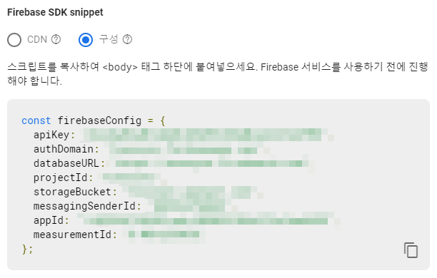

## [ARA]Python에서 Firebase Authentication으로 로그인하기

원래 2학기에 시작하기로 한 프로젝트인데 학교 수업이니 뭐니 하다보니 쭉 밀리고 밀려 방학까지 밀리게 되버린 프로젝트가 있다.

결말이 어떨진 모르지만 여튼 런칭이 목적이라 같이 진행하는 지인이 아이디어 노출은 하지 말아달라해서 자세히는 말하지 못하고 Firebase를 이용하는 Python 데스크탑 프로그램이다 정도로 말 해야할 것 같다.
 
GUI 프로그램을 만들어야 해서 방학 시작하자마자 PyQt 스터디를 뒹굴뒹굴 했고 이제 제대로 된 프로그램 개발을 시작해서 개발일지도 같이 작성하기로 했다.

Firebase가 무엇인지 자세한 설명은 어렵지만 간단하게 살펴보니 backend에서 생각해야할 db나 계정 등록 같은 걸 처리해주고 frontend에 집중할 수 있게 해주는 서비스 같다.

이번 프로젝트에서는 realtime database를 중점으로 사용할 것인데 이에 접근하는 방법이 firebase_admin을 이용한 방법과 authentication을 이용해서 각 계정별로 접근하는 방법 두가지가 있다.

프로그램 목적이 사용자마다 다른 내용을 제공해야 하므로 authentication을 이용해 로그인하는 방법을 선택했다.

우선 파이썬에서 firebase에 접속하기 위해 firebase에서 호스팅 옵션 없이 web app을 하나 생성하고 SDK snippet에서 스크립트를 가져와 파이썬 앱에 붙여 넣으면 된다.

대신 웹에서 사용되는 코드이기에 약간의 수정이 필요한데

~~~ python
firebaseConfig = {
    "apiKey": "...",
    "authDomain": "...",
    "databaseURL": "...",
    "projectId": "...",
    "storageBucket": "...",
    "messagingSenderId": "...",
    "appId": "...",
    "measurementId": "..."
}
~~~
같이 const를 제외한 뒤 안의 내용은 딕셔너리 형태로 변경해주면 된다.

그러고나서 이전에 작성한 [게시글](https://hanchaa.github.io/dev/pip_install_unicodedecodeerror)을 참고하여 [pyrebase]()를 설치한 후 import하여

~~~ python
firebase = pyrebase.initialize_app(firebaseConfig)

auth = firebase.auth()
~~~

같이 작성하면 "auth."을 통해 firebase에 접근하는 여러가지 명령어를 사용할 수 있다.

~~~ python
if __name__ == "__main__":
    print("1. Sing in")
    print("2. Sing up")
    print("3. Forgot Password")

    choice = int(input("Input: "))
    print()

    user = [0]

    if choice == 1:
        print("Sing in")

        while True:
            email = input("Email: ")
            pw = getpass("Password: ")

            # 로그인 에러가 없을 때까지 로그인 반복
            if sign_in(email, pw, user) == 1:
                break

        print("Successfully signed in to TossSync!")

    elif choice == 2:
        print("Sing up")

        while True:
            email = input("Email: ")
            pw = getpass("Password: ")

            # 회원가입 에러가 없을 때까지 회원가입 반복
            if sign_up(email, pw, user) == 1:
                break

        print("Successfully signed up to TossSync!")
        print("Check your e-mail")
        auth.send_email_verification(user[0]["idToken"])  # 확인 이메일 발송

    elif choice == 3:
        print("Forgot password")

        while True:
            email = input("Email: ")

            if forgot_pw(email) == 1:
                break

        print("Password reset address has been sent by email.")
~~~

Sign in / Sign Up / Forgot Password 총 3가지 기능을 우선 구현하였는데 구현 로직은 비슷하고 사용하는 함수만 조금씩 차이가 난다.

~~~ python
# 로그인 함수
def sign_in(e, p, u):
    print("Wait a moment\n")

    # 로그인 시도시 에러 발생하면 에러내용 띄운 후 -1 반환
    try:
        u[0] = auth.sign_in_with_email_and_password(e, p)

    except requests.exceptions.HTTPError as e:
        error_json = e.args[1]
        error = json.loads(error_json)["error"]
        # print(e) # 에러내용 전체 표시 위한 코드
        print(error["message"] + "\n")

        return -1

    # 에러 미발생 시 1 반환
    return 1
~~~

로그인은 auth.sign_in_with_email_and_password("email", "password") 함수를 통해 구현이 가능한데 로그인이 성공하면 로그인한 유저에 대한 내용이 반환되어 u[0]에 저장된다.

user data를 전역변수로 사용하지 않기 위해 리스트에 데이터를 넣은 것이니 굳이 리스트를 사용할 필요는 없다.

그리고 로그인을 하다가 이메일이 잘 못 됐든, 비밀번호가 잘 못 됐든 request.exceptions.HTTPError를 발생시키는데 에러 내용을 파싱해보면 어떤 에러인지 알아낼 수 있다.

~~~
"error": {
    "code": 400,
    "message": "INVALID_EMAIL",
    "errors": [
      {
        "message": "INVALID_EMAIL",
        "domain": "global",
        "reason": "invalid"
      }
    ]
  }
~~~ 

json을 디코딩 하면 나오는 에러 내용인데 message를 가져와서 어떤 에러인지 출력시킬 수 있다.

에러가 발생하면 에러 내용을 띄우고 -1을 반환해 반복하고 정상적으로 로그인이 되면 1을 반환해 로그인 과정이 종료되도록 하였다.

~~~ python
# 회원가입 함수
def sign_up(e, p, u):
    print("Wait a moment\n")

    # 회원가입 시도시 에러 발생하면 에러내용 띄운 후 -1 반환
    try:
        u[0] = auth.create_user_with_email_and_password(e, p)

    except requests.exceptions.HTTPError as e:
        error_json = e.args[1]
        error = json.loads(error_json)["error"]
        # print(e) # 에러내용 전체 표시 위한 코드
        print(error["message"] + "\n")

        return -1
    # 에러 미발생 시 1 반환
    return 1

# 비밀번호 초기화 함수
def forgot_pw(e):
    print("Wait a moment\n")

    try:
        auth.send_password_reset_email(e)

    except requests.exceptions.HTTPError as e:
        error_json = e.args[1]
        error = json.loads(error_json)["error"]
        # print(e)
        print(error["message"] + "\n")

        return -1

    return 1
~~~

회원가입 함수랑 비밀번호 초기화 함수인데 이것도 비슷하다.

대신에 회원가입을 할 때는 auth.create_user_with_email_and_password("email", "password") 함수를 이용하고 비밀번호 초기화는 auth.send_password_reset_email("email") 함수를 이용한다는 차이가 있다. 

나중에 PyQt로 GUI를 구성하기만 하면 프로그램의 시작은 구현 끝났다.
