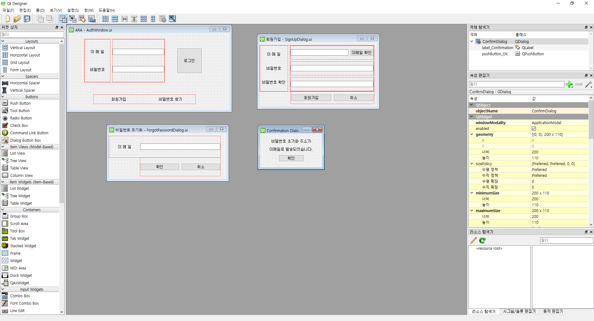
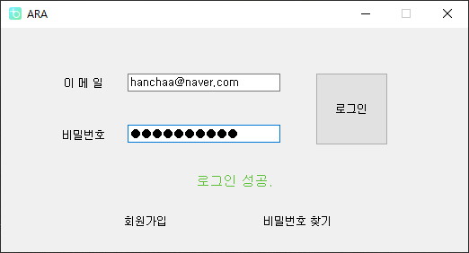
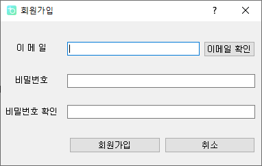
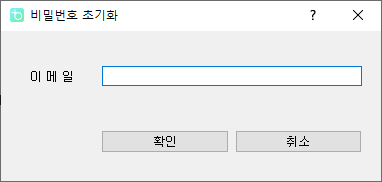
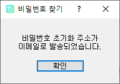

## [ARA]PyQt 이용해 ARA 로그인 화면 GUI 구현

원래 구현은 2월 초에 끝난거 같은데 이제야 쓰는 늦은 일지이다.

그 기간 사이에 프로그램 이름을 TossSync에서 ARA로 변경하였다.

우선 GUI를 구현하기 전에 이전에 만든 로그인 로직을 하나의 모듈로 정리하였다.

소스 코드 접기 / 펼치기

~~~ python
import json
import pyrebase
import requests

# 로그인 함수
def sign_in(e, p, u, config):
    firebase = pyrebase.initialize_app(config)
    auth = firebase.auth()

    print("TRY_SIGNING_IN")

    # 로그인 시도시 에러 발생하면 에러내용 띄운 후 -1 반환
    try:
        u[0] = auth.sign_in_with_email_and_password(e, p)

        # 이메일 주소 인증 확인
        if not auth.get_account_info(u[0]['idToken'])['users'][0]['emailVerified']:
            print("EMAIL_NOT_VERIFIED")
            return 2

    except requests.exceptions.HTTPError as e:
        error_json = e.args[1]
        error = json.loads(error_json)["error"]
        # print(e) # 에러내용 전체 표시 위한 코드
        print(error["message"])

        return error["message"]

    # 에러 미발생 시 1 반환
    print("SIGN_IN_SUCCESS")
    return 1

# 회원가입 함수
def sign_up(e, p, u, config):
    print("TRY_SIGNING_UP")
    firebase = pyrebase.initialize_app(config)
    auth = firebase.auth()

    # 회원가입 시도시 에러 발생하면 에러내용 띄운 후 -1 반환
    try:
        u[0] = auth.create_user_with_email_and_password(e, p)

    except requests.exceptions.HTTPError as e:
        error_json = e.args[1]
        error = json.loads(error_json)["error"]
        # print(e) # 에러내용 전체 표시 위한 코드
        print(error["message"])

        return error["message"]

    auth.send_email_verification(u[0]["idToken"])  # 확인 이메일 발송
    print("SIGN_UP_SUCCESS")

    # 에러 미발생 시 1 반환
    return 1

# 비밀번호 초기화 함수
def forgot_pw(email, config):
    firebase = pyrebase.initialize_app(config)
    auth = firebase.auth()

    try:
        auth.send_password_reset_email(email)

    except requests.exceptions.HTTPError as email:
        error_json = email.args[1]
        error = json.loads(error_json)["error"]
        # print(e)
        print(error["message"])

        return -1

    print("PASSWORD_RESET_LINK_SENT")

    return 1
~~~

함수를 호출할 때 firebase config 정보랑 user 정보도 매개변수로 받아서 처리하도록 하였다.

~~~ python
# 이메일 주소 인증 확인
        if not auth.get_account_info(u[0]['idToken'])['users'][0]['emailVerified']:
            print("EMAIL_NOT_VERIFIED")
            return 2
~~~

또 추가 된게 있는데 로그인 후에 생기는 user 정보 중에서 이메일 인증이 됐는지 확인하는 딕셔너리를 이용해 이메일 인증이 안 됐을 경우 로그인이 불가능하게 바꾸었다.

auth.get_account_info("user id token")을 이용하면 로그인 한 계정의 여러 정보를 확인 할 수 있다.

GUI는 PyQt를 이용해서 구현하였다.

코드로 클래스를 만들어서 구현도 가능하지만 관리의 용이함을 위해 Qt Designer 프로그램을 이용해 ui 파일을 만들어 코드에서 uic로 import 하는 방법을 이용했다.

프로그램을 실행하면 제일 먼저 나오는 로그인 화면이다.

마지막에 이제 버튼등의 UI를 수정하긴 하겠지만 여기서 크게 바뀌지는 않을 것 같다.

소스 코드 접기/펼치기

~~~ python
from .toss_auth import *
from PyQt5.QtWidgets import *
from PyQt5 import uic
from PyQt5.QtGui import QIcon
from .SignUpDialog import SignUpDialog
from .ForgotPasswordDialog import ForgotPasswordDialog

form_class = uic.loadUiType("ui/auth_ui/AuthWindow.ui")[0]

class AuthWindow(QWidget, form_class):
    def __init__(self, config, user):
        super().__init__()
        self.setupUi(self)

        self.setWindowIcon(QIcon("icon.png"))

        self.firebaseConfig = config
        self.user = user

        self.lineEdit_ID.returnPressed.connect(self.lineEdit_PW.setFocus)
        self.lineEdit_PW.returnPressed.connect(self.sign_in_clicked)
        self.pushButton_SignIn.clicked.connect(self.sign_in_clicked)

        self.pushButton_SignUp.clicked.connect(self.sign_up_clicked)

        self.pushButton_ForgotPW.clicked.connect(self.forgot_pw_clicked)

        self.show()

    def sign_in_clicked(self):
        # 이메일 미입력 처리
        if self.lineEdit_ID.text() == "":
            self.label_status.setText("이메일을 입력해주세요.")
            self.lineEdit_ID.setFocus()
            return

        # 비밀번호 미입력 처리
        if self.lineEdit_PW.text() == "":
            self.label_status.setText("비밀번호를 입력해주세요.")
            self.lineEdit_PW.setFocus()
            return

        # 로그인 시도
        email = self.lineEdit_ID.text()
        pw = self.lineEdit_PW.text()

        result = sign_in(email, pw, self.user, self.firebaseConfig)

        # 로그인 성공
        if result == 1:
            self.label_status.setStyleSheet("color : #5BC236;")
            self.label_status.setText("로그인 성공.")

        # 이메일 미인증
        elif result == 2:
            self.label_status.setText("이메일 인증이 완료되지 않았습니다.")
            self.lineEdit_PW.setText("")
            self.lineEdit_PW.setFocus()

        # 없는 이메일 주소
        elif result == "EMAIL_NOT_FOUND" or result == "INVALID_EMAIL":
            self.label_status.setText("존재하지 않는 아이디입니다.")
            self.lineEdit_PW.setText("")
            self.lineEdit_ID.selectAll()
            self.lineEdit_ID.setFocus()

        # 잘못된 비밀번호
        elif result == "INVALID_PASSWORD":
            self.label_status.setText("잘못된 비밀번호입니다.")
            self.lineEdit_PW.setText("")
            self.lineEdit_PW.setFocus()

        # 너무 많은 시도
        elif result == "TOO_MANY_ATTEMPTS_TRY_LATER : Too many unsuccessful login attempts. Please try again later.":
            self.label_status.setText("너무 많이 시도했습니다. 잠시 후 다시 시도해주세요.")
            self.lineEdit_PW.setText("")
            self.lineEdit_PW.setFocus()

        # 혹시 모를 남은 오류
        else:
            self.label_status.setText("알 수 없는 오류입니다. 문의해주세요.")
            self.lineEdit_PW.setText("")
            self.lineEdit_PW.setFocus()

        print()

    def sign_up_clicked(self):
        signup = SignUpDialog(self.firebaseConfig, self.user)
        signup.exec_()
        del signup

        self.lineEdit_ID.setFocus()

    def forgot_pw_clicked(self):
        f_pw = ForgotPasswordDialog(self.firebaseConfig, self.user)
        f_pw.exec_()
        del f_pw

        self.lineEdit_ID.setFocus()
~~~

로그인 버튼을 누르면 모듈로 만든 함수를 이용해 로그인을 시도하고 반환되는 오류를 이용해 비밀번호와 회원가입 버튼 사이의 공간에 에러를 띄우게 해뒀다.

그리고 회원가입과 비밀번호 찾기 버튼을 클릭하면 새로운 dialog 창을 띄우도록 slot을 연결하였다.

새로 띄워지는 창이 dialog이기 때문에 창을 닫기 전에는 로그인 창에 입력이 불가능하다.

소스 코드 접기/펼치기

~~~ python
from auth.toss_auth import *
from PyQt5.QtWidgets import *
from PyQt5 import uic
from PyQt5.QtGui import QIcon
from .ConfirmDialog import ConfirmDialog

form_class = uic.loadUiType("ui/auth_ui/SignUpDialog.ui")[0]

class SignUpDialog(QDialog, form_class):
    def __init__(self, config, user):
        super().__init__()
        self.setupUi(self)

        print("SIGN_UP")

        self.setWindowIcon(QIcon("icon.png"))

        self.firebaseConfig = config
        self.user = user

        self.lineEdit_ID.returnPressed.connect(self.check_id)
        self.pushButton_Check_ID.clicked.connect(self.check_id)
        self.lineEdit_PW.returnPressed.connect(self.lineEdit_PW_re.setFocus)
        self.lineEdit_PW_re.returnPressed.connect(self.check_pw)
        self.lineEdit_PW.textChanged.connect(self.pw_changed)
        self.pushButton_SignUp.clicked.connect(self.check_pw)
        self.pushButton_Cancel.clicked.connect(self.reject)

    def check_id(self):
        if self.lineEdit_ID.text() == "":
            self.label_Check_ID.setStyleSheet("color : red;")
            self.label_Check_ID.setText("아이디를 입력해주세요")
            return

        print("CHECK_EMAIL")
        result = sign_in(self.lineEdit_ID.text(), "1", self.user, self.firebaseConfig)

        if result == "INVALID_PASSWORD":
            print("EMAIL_EXIST")
            self.label_Check_ID.setStyleSheet("color : red;")
            self.label_Check_ID.setText("이미 사용중인 이메일입니다.")
            self.lineEdit_ID.selectAll()
            self.lineEdit_ID.setFocus()

        elif result == "INVALID_EMAIL":
            print("UNAVAILABLE_EMAIL")
            self.label_Check_ID.setStyleSheet("color : red;")
            self.label_Check_ID.setText("잘못된 이메일 형식입니다.")
            self.lineEdit_ID.selectAll()
            self.lineEdit_ID.setFocus()

        elif result == "EMAIL_NOT_FOUND":
            print("AVAILABLE_EMAIL")
            self.label_Check_ID.setStyleSheet("color : #5BC236;")
            self.label_Check_ID.setText("사용 가능한 이메일입니다.")
            self.lineEdit_PW.setFocus()

        print()

    def check_pw(self):
        if self.lineEdit_PW.text() == "" or self.lineEdit_PW_re.text() == "":
            self.label_Check_PW.setStyleSheet("color : red;")
            self.label_Check_PW.setText("비밀번호를 입력하세요.")
            return

        print("CHECK_PASSWORD")
        if self.lineEdit_PW.text() != self.lineEdit_PW_re.text():
            print("PASSWORD_NOT_MATCH")
            self.label_Check_PW.setStyleSheet("color : red;")
            self.label_Check_PW.setText("비밀번호가 틀립니다.")
            self.lineEdit_PW_re.setText("")
            self.lineEdit_PW.setText("")
            self.lineEdit_PW.setFocus()

        else:
            print("PASSWORD_MATCH\n")

            email = self.lineEdit_ID.text()
            pw = self.lineEdit_PW.text()
            result = sign_up(email, pw, self.user, self.firebaseConfig)

            confirmation = ConfirmDialog()

            confirmation.setWindowTitle("회원가입")
            confirmation.label_Confirmation.setText("이메일로 발송된 주소를 통해\n이메일 인증을 진행해 주세요.")

            if result != 1:
                confirmation.label_Confirmation.setText("오류가 발생했습니다.\n문의해주세요.")

            confirmation.exec_()
            del confirmation

            self.accept()

        print()

    def pw_changed(self):
        if self.lineEdit_PW.text() != "":
            self.label_Check_PW.setText("")
~~~

로그인과 마찬가지로 모듈화한 함수를 이용해 회원가입을 시도하고 함수에서 반환하는 정보를 이용해 이메일 중복확인과 회원가입을 처리한다.

소스 코드 접기/펼치기

~~~ python
from auth.toss_auth import *
from PyQt5.QtWidgets import *
from PyQt5 import uic
from PyQt5.QtGui import QIcon
from .ConfirmDialog import ConfirmDialog

form_class = uic.loadUiType("ui/auth_ui/ForgotPasswordDialog.ui")[0]

class ForgotPasswordDialog(QDialog, form_class):
    def __init__(self, config, user):
        super().__init__()
        self.setupUi(self)

        self.setWindowIcon(QIcon("icon.png"))

        self.firebaseConfig = config
        self.user = user

        self.label_Status.setStyleSheet("color : red;")

        self.pushButton_Cancel.clicked.connect(self.reject)
        self.lineEdit_ID.returnPressed.connect(self.ok_clicked)
        self.pushButton_OK.clicked.connect(self.ok_clicked)

        print("FORGOT_PASSWORD")

    def ok_clicked(self):
        result = forgot_pw(self.lineEdit_ID.text(), self.firebaseConfig)

        if result == 1:
            confirmation = ConfirmDialog()

            confirmation.setWindowTitle("비밀번호 찾기")
            confirmation.label_Confirmation.setText("비밀번호 초기화 주소가\n이메일로 발송되었습니다.")

            confirmation.exec_()
            del confirmation

            self.accept()

        elif result == "INVALID_EMAIL" or result == "EMAIL_NOT_FOUND":
            self.label_Status.setText("이메일을 확인해 주세요.")

            self.lineEdit_ID.selectAll()
            self.lineEdit_ID.setFocus()

        else:
            self.label_Status.setText("알 수 없는 오류입니다. 문의해주세요.")

        print()
~~~

비밀번호 초기화도 마찬가지로 함수에서 반환하는 값을 이용해 오류와 비밀번호 초기화 주소 이메일 발송 결과를 처리한다.

소스 코드 접기/펼치기

~~~ python
from PyQt5.QtWidgets import *
from PyQt5 import uic
from PyQt5.QtGui import QIcon

form_class = uic.loadUiType("ui/auth_ui/ConfirmDialog.ui")[0]

class ConfirmDialog(QDialog, form_class):
    def __init__(self):
        super().__init__()
        self.setupUi(self)

        self.setWindowIcon(QIcon("icon.png"))

        self.pushButton_OK.clicked.connect(self.accept)
~~~

회원가입과 비밀번호 초기화의 마지막 단계에 보면 confirmation dialog를 생성하는 것을 볼 수 있는데 하나의 ui를 만들어놓고 상세 내용은 코드 상에서 바꾸도록 처리하였다.

~~~ python
# 회원가입
confirmation = ConfirmDialog()
confirmation.setWindowTitle("회원가입")
confirmation.label_Confirmation.setText("이메일로 발송된 주소를 통해\n이메일 인증을 진행해 주세요.")

# 비밀번호 초기화
confirmation = ConfirmDialog()
confirmation.setWindowTitle("비밀번호 찾기")
confirmation.label_Confirmation.setText("비밀번호 초기화 주소가\n이메일로 발송되었습니다.")
~~~

이걸로 우선 로그인 화면 구현은 끝났다.

아직 로그인 화면에서도 자동로그인 설정을 해야하는게 남았는데 자동로그인 정보를 어떻게 저장할지도 생각해야하고 메인 기능을 구현하고 생각해도 늦지 않을꺼 같아서 일단 남겨두기로 했다.
