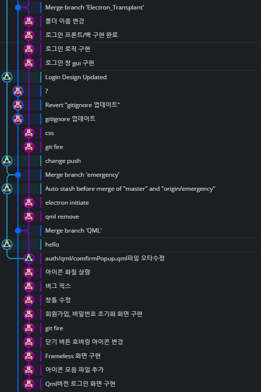
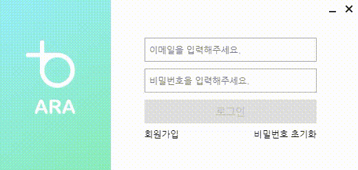

## [ARA]GUI 프레임워크 Qt에서 Electron으로 바꾸기

이야기를 해보자면 기존에는 PyQt를 이용해 GUI를 구현하였다.

그런데 Busy Indicator를 어떻게 넣는지 찾아보는데 Qml이란게 나왔다.

Qml이 알고보니 Qt에서 나온 마크업 언어인데 이게 GUI 구현의 편의성이나 관리가 더 편해보여서 이걸로 우선은 갈아 탔었다.

그렇게 기존에 구현해둔 것 까지 다 구현 했는데 딱 하나가 안 됐다.

바로 Frameless 화면에서 창을 화면 가로 가져가면 창의 크기가 바뀌는 Window Aero 기능등이 안 됐었다.

옛날 한글 프로그램이 이게 안 돼서 Aero 기능이 없으면 얼마나 불편한지 알았기에 C++ Win32 API로 기능을 구현하고 파이썬에 바인딩 해야하나 생각하던 중 어떤 계기로 Electron이란 프레임워크를 알게 됐다.

찾아보니까 크로미움에 html을 띄우는 형식으로 앱을 구현하는 프레임워크였고 시험 삼아 Frameless 화면으로 example을 하나 만들어보니 내가 원하던게 딱 구현이 되길래 바로 넘어왔다.

Git log를 보면 갑자기 Qml로 로그인 화면을 구현하고 잘 가다가 갑자기 Qml Remove가 나오고 Electron이 나오기 시작한다.

여기까지가 Electron으로 넘어오게 된 짧은 스토리이고 자바스크립트는 그전에 겉핥기로 살짝 해본게 다라 비동기나 콜백함수와 같은 부분에서 애를 많이 썼는데 앱을 구현하다 보니 어느정도 개념이 잡히기 시작했다.

NPM main.js 접기 / 펼치기

~~~ javascript
const {app, BrowserWindow, ipcMain} = require('electron');
const path = require('path');
const firebase = require("firebase/app");
require('firebase/auth');
const { logger } = require('./logger.js');

ARA = {
    date: new Date()
};

function firebaseConfig() {
    let config = {
        apiKey,
        authDomain,
        databaseURL,
        projectId,
        storageBucket,
        messagingSenderId,
        appId,
        measurementId
    };

    return function () {
        return config;
    }
} // firebase config 클로저 이용해 숨기기

firebase.initializeApp(firebaseConfig()());

function createWindow(filepath, w, h, resize) {
    let window = new BrowserWindow({
        width: w,
        height: h,
        frame: false,
        icon: path.join(__dirname, 'image/icon.png'),
        webPreferences: {
            nodeIntegration: true
        },
        show: false
    });
    window.resizable = resize;
    window.loadFile(filepath);

    window.once('ready-to-show', () => {
        window.show(); // 모든 엘레멘트 로딩 완료 후 화면 띄우기
        logger.info(filepath + " opened");
    });

    window.once("closed", () => {
        logger.info(filepath + " closed");
    });

    // 관리자 도구
    // window.webContents.openDevTools();
}

app.whenReady().then(() => {
    logger.info("app started");
    createWindow('html/auth/authWindow.html', 520, 250, false) // 앱 실행 준비 후 로그인 창 생성
});

app.on('will-quit', () => {
   logger.info("app quit");
});

// 파이어베이스 인증 관련 통신 부분
// 기본적으로 통신 답장은 인증 시도시 나오는 에러 코드를 이용하며 에러가 나지 않은 상황에서는 임의로 만든 string을 반환
// Renderer로 부터 SignIn 채널로 통신을 받으면 파이어베이스 로그인 시도
ipcMain.on("SignIn", (e, arg1, arg2) => {
    logger.info("firebase sign in");

    firebase.auth().signInWithEmailAndPassword(arg1, arg2).then(() => {
        logger.info("signed in");
        if (firebase.auth().currentUser.emailVerified)
            e.returnValue = "signed-in";
        else {
            e.returnValue = "email-not-verified";
            logger.info("email not verified");
        }
    }).catch(error => {
        logger.info(error.code);
        e.returnValue = error.code;
    });
});

// Renderer로 부터 EmailReSend 채널로 통신을 받으면 이메일 인증 메일 재발송
ipcMain.on("EmailResend", e => {
    logger.info("firebase verification email resend");

    firebase.auth().currentUser.sendEmailVerification().then(() => {
        logger.info("email sent");
    }).catch(error => {
        logger.info(error.code);
    });
});

// Renderer로 부터 CheckEmail 채널로 통신을 받으면 이메일 중복 확인
ipcMain.on("CheckEmail", (e, arg) => {
    logger.info("firebase check email duplication");
    
    // 이메일 중복확인은 더미 패스워드 1로 로그인 시도를 해보고 user-not-found가 중복되지 않았다고 판단
    firebase.auth().signInWithEmailAndPassword(arg, "1").then(() => {
        logger.info("signed in");
    }).catch(error => {
        logger.info(error.code);
        e.returnValue = error.code;
    });
});

// Renderer로 부터 SingUp 채널로 통신을 받으면 유저 생성
ipcMain.on("SignUp", (e, arg1, arg2) => {
    logger.info("firebase sign up");

    firebase.auth().createUserWithEmailAndPassword(arg1, arg2).then(() => {
        logger.info("user created");
        
        // 유저가 성공적으로 생성되면 인증 이메일 발송
        firebase.auth().currentUser.sendEmailVerification().then(() => {
            logger.info("verification email sent")
        }).catch(error => {
            logger.info(error.code);
        });

        e.returnValue = "signed-up";
    }).catch(error => {
        logger.info(error.code);
        e.returnValue = error.code;
    })
});

// Renderer로 부터 ForgotPassword 통신을 받으면 비밀번호 초기화 주소 발송
ipcMain.on("ForgotPassword", (e, arg) => {
    logger.info("firebase password reset");

    firebase.auth().sendPasswordResetEmail(arg).then(() => {
        logger.info("password reset link sent");
        e.returnValue = "email-sent";
    }).catch(error => {
        logger.info(error.code);
        e.returnValue = error.code;
    })
});
~~~

왠만한 부분은 모두 주석으로 달아두었다.

자바스크립트의 경우 기본적으로 비동기로 함수가 작동하기 때문에 통신을 받고 인증 시도와 답장을 따로 하면 답장이 먼저 간다.

이를 방지하기 위해 파이어베이스 인증 함수에 구현되어 있는 프로마이즈를 이용해 인증이 모두 끝나면 통신 답장을 보냈다.

catch에는 모두 로거를 달아놔서 나중에 로그파일을 통해 개발 단계에서 몰랐던 오류가 무엇이 났는지 확인이 가능하다.

현재 개발 단계에서 몰랐던 오류를 답장을 받으면 알 수 없는 오류라고 처리해뒀다.

QML로 바꾸면서 메인 로그인 화면도 바꿨다.

주변사람들이 디자인 깔끔하고 이쁘다고 하기도하고 나도 개인적으로 만족한다.

oAuth 기능을 추가하면 아래 쪽에 oAuth 제공업체 버튼을 추가할 예정이다.

HTML 접기 / 펼치기

~~~ html
<!DOCTYPE html>
<html>
  <head>
    <link rel = "stylesheet" href="../../css/auth/authWindow.css">

    <meta charset="UTF-8">
    <!-- https://developer.mozilla.org/en-US/docs/Web/HTTP/CSP -->
    <meta http-equiv="Content-Security-Policy" content="default-src 'self'; script-src 'self'">
    <meta http-equiv="X-Content-Security-Policy" content="default-src 'self'; script-src 'self'">
    <title>ARA</title>
  </head>
  <body>
    <!-- 타이틀바 영역 --->
    

    
    <!-- 창 조작 버튼 영역 --->
    

      <button class="winBtn" id="minimize" tabindex="-1"></button>
      <button class="winBtn" id="close" tabindex="-1"></button>
    

    
    <!-- 인증 관련 정보 입력 영역 --->
    

      <label for="email"></label>
      <input type="text" id="email" placeholder="이메일을 입력해주세요.">
      <label for="password"></label>
      <input type="password" id="password" placeholder="비밀번호을 입력해주세요.">
      <button id="signIn" disabled="" tabindex="-1">로그인</button>
       
      <button class = "textBtn" id="signUp" tabindex="-1">회원가입</button>
      <button class = "textBtn" id="forgotPassword" tabindex="-1">비밀번호 초기화</button>
    

    
    <!-- 인증상태 표시 영역 --->
    

      
이메일 또는 비밀번호가 일치하지 않습니다.

      
이메일을 인증해주세요.
        <button id="emailResend" tabindex="-1">이메일 재발송</button>
      

      
알 수 없는 에러입니다. 문의해주세요.

    

    
  </body>
</html>
~~~

CSS 접기 / 펼치기

~~~ css
* {
    font-family: 나눔고딕, Nanum Gothic;
    box-sizing: border-box;
}

#titleBar {
    -webkit-app-region: drag;
    position: absolute;
    top: 0px;
    left: 0px;
    width: 520px;
    height: 25px;
}

#winCmdDiv {
    position: absolute;
    top: 1px;
    left: 471px;
}

.winBtn {
    -webkit-app-region: no-drag;
    padding: 0px;
    border: 0;
    margin-right: -4px;
    height: 24px;
    width: 24px;
    outline: none;
}

#close {
    background-image: url("../../image/close.png");
}

#close:hover {
    background-image: url("../../image/close_click.png");
}

#minimize {
    background-image: url("../../image/minimize.png");
}

#authDiv {
    position: absolute;
    top: 50px;
    left: 210px;
}

input[type="text"], input[type="password"], #signIn {
    padding-left: 5px;
    padding-right: 5px;
    width: 250px;
    height: 35px;
    margin-top: 5px;
    margin-bottom: 5px;
}

input[type="text"]:focus, input[type="password"]:focus {
    outline: none !important;
    border: 2px solid rgb(121 237 180);
    box-shadow: 0 0 5px -1px rgb(121 237 180);
}

#signIn {
    background-color: rgb(121 237 180);
    border: none;
    color: white;
    font-size: 15px;
    cursor: pointer;
    outline: none;
    transition: background-color 0.4s ease;
}

#signIn:hover {
    background-color: rgb(106 212 160);
    transition: background-color 0.4s ease;
}

#signIn:disabled {
    background-color: #e0e0e0;
    color: #bdbdbd;
    cursor: default;
}

#signUp, #forgotPassword {
    background-color: transparent;
    padding: 0;
    outline: 0;
    border: 0;
    cursor: pointer;
}

#forgotPassword {
    position: relative;
    left: 104px;
}

#statusDiv {
    position: absolute;
    top: 210px;
    left: 210px;
    width: 250px;
    font-size: 12px;
    color: red;
    text-align: center;
}

#signInStatus, #emailNotVerified, #unknownError {
    display: none;
}

#emailResend {
    background-color: transparent;
    padding: 0;
    border: 0;
    outline: 0;
    cursor: pointer;
    font-size: 12px;
    text-decoration: underline;
    color: red;
}

body {
    padding: 0;
    margin: 0;
    background-color: white;
    background-image: url("../../image/background.png");
    background-repeat: no-repeat;
    background-position: top left;
}
~~~

Javascript 접기 / 펼치기

~~~ javascript
const remote = require('electron').remote;
const {ipcRenderer} = require('electron');
let curWin = remote.getCurrentWindow();
const {logger} = require('../../logger.js');

ARA = {
    focusedItem: undefined,
    width: curWin.getSize()[0],
    height: curWin.getSize()[1]
};

window.onload = () => {
    document.getElementById("email").focus(); // 페이지가 로드 되면 이메일 필드에 포커스 맞추기
};

// 창 조작 버튼 스크립트
document.getElementById('close').addEventListener('click', () => {
    curWin.close();
});

document.getElementById('minimize').addEventListener('click', () => {
    curWin.minimize();
    document.getElementById('minimize').style.backgroundImage = "url('../../image/minimize.png')";
});

document.getElementById('minimize').addEventListener('mouseover', () => {
    document.getElementById('minimize').style.backgroundImage = "url('../../image/minimize_click.png')";
});

document.getElementById('minimize').addEventListener('mouseleave', () => {
    document.getElementById('minimize').style.backgroundImage = "url('../../image/minimize.png')";
});

// 포커스를 다른 입력 필드로 바꿀 때 마다 포커스 된 요소 저장
document.querySelectorAll("input").forEach(element => {
    element.addEventListener("focus", () => ARA.focusedItem = element);
});

// electron에서 resize할 수 없는 frameless 윈도우를 최소화했다가 복구 했을 때 창의 크기가 달라지는 오류 해결을 위한 스크립트
// 최소화할 때 창 크기를 이상하게 바꾸는 것 같아 수동으로 다시 바꿔준다
curWin.on("minimize", () => {
    curWin.setSize(ARA.width, ARA.height);
});

// 창을 복구했을 때 이전에 포커스를 가지고 있던 필드에 다시 포커스를 맞춰준다
// 최소화버튼을 눌러서 최소화 했을 경우 창을 복구했을 때 그전에 포커스를 가지고 있던 필드에 포커스가 안 맞기 때문에 수동으로 해준다
curWin.on("restore", () => {
    ARA.focusedItem.focus();
});

function textChanged() {
    // 이메일 필드의 값이 이메일 형식 정규표현식을 만족하고 비밀번호 필드의 값이 6자리 이상이면 로그인 버튼을 활성화
    // 파이어베이스의 weak password 제약은 6자리 미만 비밀번호다
    let emailText = /^[A-Za-z0-9_\.\-]+@[A-Za-z0-9\-]+\.[A-Za-z0-9\-]+/;
    document.getElementById('signIn').disabled = !(emailText.test(document.getElementById('email').value) && document.getElementById('password').value.length > 5);
    // 필드의 값이 바뀌면 그전에 띄워져있던 인증 상태 텍스트를 모두 숨김
    document.querySelectorAll(".status").forEach(element => element.style.display = "none");
}

// 입력 필드 이벤트 리스너 연결
document.querySelectorAll("input").forEach(element => {
    element.addEventListener("input", () => textChanged());
    element.addEventListener("keypress", e => {
        if (e.key === "Enter")
            document.getElementById("signIn").click();
    })
});

// 로그인 버튼 이벤트리스너 연결
document.getElementById("signIn").addEventListener("click", () => {
    // 메인 프로세스로 SignIn채널을 통해 통신을 보내 로그인 결과를 받아옴
    // 비동기 통신을 이용하면 로그인 결과를 올바르게 처리할 수 없으므로 동기 통신을 이용
    let result = ipcRenderer.sendSync("SignIn", document.getElementById("email").value, document.getElementById("password").value);

    // 로그인 성공시 창 닫기
    if (result === "signed-in") {
        window.close();
        return;
    }

    // 결과별 인증 상황 표시
    else if (result === "auth/wrong-password" || result === "auth/invalid-email" || result === "auth/user-not-found")
        document.getElementById("signInStatus").style.display = "block";
    else if (result === "email-not-verified")
        document.getElementById("emailNotVerified").style.display = "block";
    else
        document.getElementById("unknownError").style.display = "block";

    // 로그인 실패시 비밀번호 필드 값을 삭제하고 비밀번호 필드에 포커스를 맞춘다다
    document.getElementById("password").value = "";
    document.getElementById("password").focus();
    document.getElementById("signIn").disabled = true;
});

// 이메일 미인증 계정 로그인 시도 때 이메일 재발송이 필요한 경우를 위한 텍스트 버튼
// 이메일 발송 후 처리할 함수가 없으므로 비동기 통신 사용
document.getElementById("emailResend").addEventListener("click", () => {
    ipcRenderer.send("EmailResend");
});

// 회원가입, 비밀번호 초기화 텍스트 버튼 이벤트리스너 연결
// 회원가입 창과 비밀번호 초기화 창의 높이, 파일 경로가 달라 3항 연산자를 이용해 inf 객체에 창 높이와 파일 경로를 넣은 후 새 창을 만드는 함수에 인자로 넘겨주었다
document.querySelectorAll(".textBtn").forEach(element => {
    let inf = element === document.getElementById("signUp") ? {h: 485, path: "html/auth/signUpDialog.html"} : {h: 305, path: "html/auth/forgotPasswordDialog.html"};
    element.addEventListener("click", () => createNewWindow(inf.path, inf.h));
});

// 새 창 만들기
function createNewWindow(path, h) {
    let dialog = new remote.BrowserWindow({
        width: 300,
        height: h,
        frame: false,
        icon: 'image/icon.png',
        webPreferences: {
            nodeIntegration: true
        },
        modal: true,
        parent: curWin,
        show: false
    });

    // 부모창의 가운데 새 창을 띄우지만 새 창이 화면 범위를 벗어나는 경우 화면 가장자리에 들어오도록 창의 위치 조정
    let x = curWin.getPosition()[0] + curWin.getSize()[0] / 2 - 150;
    if (x < 0)
        x = 0;

    else if (x > screen.width - dialog.getSize()[0])
        x = screen.width - dialog.getSize()[0];

    let y = curWin.getPosition()[1] - (h / 2 - curWin.getSize()[1] / 2);
    if (y < 0)
        y = 0;

    else if (y > screen.height - dialog.getSize()[1])
        y = screen.height - dialog.getSize()[1];

    dialog.resizable = false;

    dialog.loadFile(path).then(() => {
        dialog.setPosition(Math.round(x), Math.round(y)); // 위치 좌표 값이 실수면은 오류가 발생하므로 반올림을 해줌
    });
    dialog.once("ready-to-show", () => {
        dialog.show(); // 새 창의 요소 모두 로딩 됐을 경우 창 표시
        logger.info(path + " opened");
    });

    // dialog.webContents.openDevTools();

    dialog.once("closed", () => {
        logger.info(path + " closed");
        dialog = null;
    })
}
~~~

왠만한 부분엔 다 주석 처리를 해놨기 때문에 주석을 보면 설명은 충분히 될 것이라고 생각한다.

자바스크립트로 개발을 제대로 해보는건 처음이라 많이 헤매기는 했는데 하면서 느는 것을 많이 느꼈다.

그리고 Html을 짤 때 구조랑 클래스 등을 잘 정리해둬야 스타일 입히고 스크립트 처리할 때 편하다는걸 뼈저리게 느꼈다.

처음에는 모르고 모든 요소를 하나하나 불러와서 이벤트 리스너에 연결했는데 쿼리 셀렉터를 알고 나니 코드가 많이 간결해졌다.

로그인 화면과 비밀번호 초기화 화면도 한꺼번에 올릴까하다가 글이 길어져서 따로 올려야겠다.
