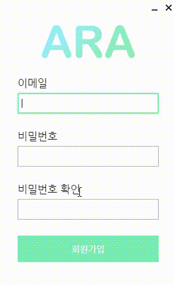

## [ARA]회원가입/비밀번호 초기화 창 구현

저번 포스팅을 이어서 바로 적을려고 했는데 과제가 나와서 이제야 적게 됐다.

위의 로그인 화면에서 로그인 버튼 아래쪽에 텍스트 버튼으로 회원가입과 비밀번호 초기화 버튼을 달아놔서 버튼을 누르면 Modal Window로 새 창이 뜨도록 구현해두었다.

### 회원가입

HTML 접기 / 펼치기

~~~ html
<!DOCTYPE html>
<html>
    <head>
        <link rel = "stylesheet" href="../../css/auth/signUpDialog.css">

        <meta charset="UTF-8">
        <!-- https://developer.mozilla.org/en-US/docs/Web/HTTP/CSP -->
        <meta http-equiv="Content-Security-Policy" content="default-src 'self'; script-src 'self'">
        <meta http-equiv="X-Content-Security-Policy" content="default-src 'self'; script-src 'self'">
        <title>ARA - 회원가입</title>
    </head>
    <body>
        <!-- 타이틀바 영역 --->
        

        <!-- 창 조작 버튼 영역 --->
        

            <button class="winBtn" id="minimize" tabindex="-1"></button>
            <button class="winBtn" id="close" tabindex="-1"></button>
        

        <!-- 상단 이미지 --->
        

        <!-- 이메일 영역 --->
        

            
이메일

            <label for="email"></label>
            <input type="text" id="email">
            
이메일을 입력해주세요.

            
사용할 수 없는 이메일입니다.

            
알 수 없는 오류입니다. 문의해주세요.

            
사용할 수 있는 이메일입니다.

        

        <!-- 비밀번호 영역 --->
        

            
비밀번호

            <label for="password"></label>
            <input type="password" id="password">
            
비밀번호를 입력해주세요.

            
비밀번호는 6자리 이상이어야 합니다.

        

        <!-- 비밀번호 확인 영역 --->
        

            
비밀번호 확인

            <label for="passwordRe"></label>
            <input type="password" id="passwordRe">
            
비밀번호를 다시 입력해주세요.

            
비밀번호가 일치하지 않습니다.

        

        <!-- 회원가입 버튼 --->
        <button id="signUp" tabindex="-1">회원가입</button>

        
    </body>
</html>
~~~

CSS 접기 / 펼치기

~~~ css
* {
    font-family: 나눔고딕, Nanum Gothic;
    box-sizing: border-box;
    padding: 0;
}

#titleBar {
    -webkit-app-region: drag;
    position: absolute;
    top: 0px;
    left: 0px;
    width: 300px;
    height: 25px;
}

#winCmdDiv {
    position: absolute;
    top: 1px;
    left: 251px;
}

.winBtn {
    -webkit-app-region: no-drag;
    border: 0px;
    padding: 0px;
    margin-right: -4px;
    height: 24px;
    width: 24px;
    outline: none;
}

#close {
    background-image: url("../../image/close.png");
}

#close:hover {
    background-image: url("../../image/close_click.png");
}

#minimize {
    background-image: url("../../image/minimize.png");
}

#topImage {
    position: absolute;
    top: 40px;
    left: 67px;
    display: block;
}

#emailDiv {
    position: absolute;
    top: 130px;
    left: 30px;
}

#passwordDiv {
    position: absolute;
    top: 220px;
    left: 30px;
}

#passwordReDiv {
    position: absolute;
    top: 310px;
    left: 30px;
}

input[type="text"], input[type="password"] {
    width: 240px;
    height: 35px;
    padding-left: 5px;
    padding-right: 5px;
    margin-top: 7px;
    margin-bottom: 6px;
}

input[type="text"]:focus, input[type="password"]:focus {
    outline: none !important;
    border: 2px solid rgb(121 237 180);
    box-shadow: 0 0 5px -1px rgb(121 237 180);
}

.text {
    font-size: 18px;
}

.fail {
    font-size: 12px;
    color: red;
    display: none;
}

.pass {
    position: relative;
    font-size: 12px;
    color: green;
    display: none;
}

#signUp {
    position: absolute;
    top: 400px;
    left: 30px;
    width: 240px;
    height: 45px;
    background-color: rgb(121 237 180);
    border: none;
    color: white;
    font-size: 15px;
    cursor: pointer;
    outline: none;
    transition: background-color 0.4s ease;
}

#signUp:hover {
    background-color: rgb(106 212 160);
    transition: background-color 0.4s ease;
}

body {
    background-color: white;
}
~~~

<summay>Javascript 접기 / 펼치기</summay>

~~~ javascript
const remote = require('electron').remote;
const { ipcRenderer } = require('electron');
let curWin = remote.getCurrentWindow();
const { logger } = require('../../logger.js');

ARA = {
    focusedItem: undefined,
    width: curWin.getSize()[0],
    height: curWin.getSize()[1]
};

window.onload = () => {
    document.querySelector("#email").focus(); // 페이지가 로드 되면 이메일 필드에 포커스 맞추기
};

// 창 조작 버튼 스크립트
document.querySelector("#close").addEventListener("click", () => {
    curWin.close();
});

document.querySelector("#minimize").addEventListener("click", () => {
    curWin.minimize();
    document.querySelector("#minimize").style.backgroundImage = "url('../../image/minimize.png')";
});

document.querySelector("#minimize").addEventListener("mouseover", () => {
    document.querySelector("#minimize").style.backgroundImage = "url('../../image/minimize_click.png')";
});

document.querySelector("#minimize").addEventListener("mouseleave", () => {
    document.querySelector("#minimize").style.backgroundImage = "url('../../image/minimize.png')";
});

// 각각의 입력필드에 포커스가 맞을 경우 focusedItem 변수에 element 저장
document.querySelectorAll("input").forEach(element => {
    element.addEventListener("focus", () => ARA.focusedItem = element);
});

// electron에서 resize할 수 없는 frameless 윈도우를 최소화했다가 복구 했을 때 창의 크기가 달라지는 오류 해결을 위한 스크립트
// 최소화할 때 창 크기를 이상하게 바꾸는 것 같아 수동으로 다시 바꿔준다
// 창을 복구했을 때 이전에 포커스를 가지고 있던 필드에 다시 포커스를 맞춰준다
// 최소화버튼을 눌러서 최소화 했을 경우 창을 복구했을 때 그전에 포커스를 가지고 있던 필드에 포커스가 안 맞기 때문에 수동으로 해준다
curWin.on("minimize", () => {
    curWin.setSize(ARA.width, ARA.height);
    ARA.focusedItem.focus();
});

// 각 입력 필드가 바꼈을 때 각 입력 필드에 해당하는 상태메세지 숨김 처리용 함수 배열
let changed = [() => {
    document.querySelectorAll(".email").forEach(element => element.style.display = "none");
}, () => {
    document.querySelectorAll(".password").forEach(element => element.style.display = "none");
}, () => {
    document.querySelectorAll(".passwordRe").forEach(element => element.style.display = "none");
}];

// 각 입력 필드가 바꼈을 때 각 입력 필드에 해당하는 상태메세지가 숨겨지도록 이벤트 리스너 연결
document.querySelectorAll("input").forEach((element, index) => {
    element.addEventListener("input", changed[index]);
});

// 이메일 필드가 포커스를 잃었을 때 이메일 유효성 검사 함수 연결
document.querySelector("#email").addEventListener('focusout', e => {
    let emailText = /^[A-Za-z0-9_\.\-]+@[A-Za-z0-9\-]+\.[A-Za-z0-9\-]+/;

    // 창 조작부를 이요해 포커스를 잃었다면 더 이상 작동하지 않고 리스너 종료
    if (e.relatedTarget === document.querySelector("#minimize") || e.relatedTarget === document.querySelector("#close"))
        return;

    // 이메일 입력 필드가 비어있으면 이메일 미입력 표시
    if (document.querySelector("#email").value === "")
        document.querySelector("#emailNotEntered").style.display = "block";

    // 이메일 형식이 틀렸을 경우 사용 불가능한 이메일 표시
    else if (emailText.test(document.querySelector("#email").value) === false) {
        document.querySelector("#emailUnusable").style.display = "block";
        // document.querySelector("#email").focus();
    }

    else {
        // 더미 패스워드로 이메일 중복 검사하도록 Main 프로세스로 CheckEmail 채널을 이용한 통신
        // 이메일 중복 검사가 끝나야 상태 표시가 정상적으로 이루어지므로 동기통신을 이용
        let result = ipcRenderer.sendSync("CheckEmail", document.querySelector("#email").value);

        // 더미 패스워드 로그인 결과가 user not found면 중복 되지 않았다고 판단, 이메일 사용가능 표시
        if (result === "auth/user-not-found")
            document.querySelector("#emailUsable").style.display = "block";
        // 로그인 결과가 wrong password 또는 invalid email일 경우 이메일 사용불가 표시
        else if (result === "auth/wrong-password" || result === "auth/invalid-email") {
            document.querySelector("#emailUnusable").style.display = "block";
            // document.querySelector("#email").focus();
        }
        // 그외의 오류에 대해서는 알수 없는 오류 표시
        else
            document.querySelector("#unknownError").style.display = "block";
    }
});

// 비밀번호 필드가 포커스를 잃었을 때 비밀번호 유효성 검사 함수 연결
document.querySelector("#password").addEventListener("focusout", e => {
    // 창 조작 버튼을 눌러서 포커스를 잃을 경우 리스너 종료
    if (e.relatedTarget === document.querySelector("#minimize") || e.relatedTarget === document.querySelector("#close"))
        return;

    // 비밀번호가 비어있을 경우 비밀번호 미입력 표시
    if (document.querySelector("#password").value === "")
        document.querySelector("#passwordNotEntered").style.display = "block";

    // 비밀번호가 5자리 이하일 경우 weak password 표시
    // 파이어베이스 비밀번호 제약은 6자리 이상이다
    else if(document.querySelector("#password").value.length < 6)
        document.querySelector("#passwordWeak").style.display = "block";

    // 비밀번호 입력값과 비밀번호 확인 입력값이 같지 않을 경우 비일치 표시
    else if(document.querySelector("#passwordRe").value !== "" && document.querySelector("#password").value !== document.querySelector("#passwordRe").value)
        document.querySelector("#passwordNotMatch").style.display = "block";
});

// 비밀번호 확인 필드가 포커스를 잃었을 때 비밀번호 확인 유효성 함수 연결
document.querySelector("#passwordRe").addEventListener("focusout", e => {
    // 창 조작 버튼을 눌러서 포커스를 잃을 경우 리스너 종료
    if (e.relatedTarget === document.querySelector("#minimize") || e.relatedTarget === document.querySelector("#close"))
        return;

    // 비밀번호 확인 입력 값이 없을 경우 미입력 표시
    if (document.querySelector("#passwordRe").value === "")
        document.querySelector("#passwordReNotEntered").style.display = "block";

    // 비밀번호가 일치하지 않는 경우 비일치 표시
    else if(document.querySelector("#password").value !== document.querySelector("#passwordRe").value)
        document.querySelector("#passwordNotMatch").style.display = "block";
});

// 비밀번호 확인 필드에서 엔터 입력 시 회원가입 버튼 클릭 함수 연결
document.querySelector("#passwordRe").addEventListener("keypress", e => {
    if (e.key === "Enter") {
        document.querySelector("#passwordRe").blur();
        document.querySelector("#signUp").click();
    }
});

// 회원가입 버튼 클릭 이벤트 리스너 연결
document.querySelector("#signUp").addEventListener("click", e => {
    // 비밀번호, 비밀번호 확인 필드가 한 번도 포커스를 갖지 못한 상태에서 회원가입 버튼을 눌렀을 때 두 필드가 비어있는지 확인
    // 이메일 필드는 창이 열리자마자 포커스를 가지기 때문에 바로 회원가입 버튼을 눌러도 focusout 이벤트에 의해 이메일 유효성을 검사하므로 제외
    if (document.querySelector("#password").value === "")
        document.querySelector("#passwordNotEntered").style.display = "block";

    if (document.querySelector("#passwordRe").value === "")
        document.querySelector("#passwordReNotEntered").style.display = "block";

    // 이메일, 비밀번호, 비밀번호 확인 관련 fail class 문장이 표시되어 있을 경우 함수를 멈추고 제일 먼저 나오는 fail 문장의 필드에 포커스 맞추기
    let elements = document.querySelectorAll(".fail");
    for (let i = 0; i < elements.length; i++) {
        if (elements[i].style.display === "block") {
            let id = '#' + elements[i].classList.item(0);
            document.querySelector(id).focus();

            return;
        }
    }

    // 모두 문제 없을 경우 회원가입 진행
    // 회원가입 결과가 나와야 이후 처리가 가능하므로 동기 통신을 이용
    let result = ipcRenderer.sendSync("SignUp", document.querySelector("#email").value, document.querySelector("#password").value);

    // 이메일 발송 팝업과 알 수 없는 오류 팝업의 크기가 다르므로 결과에 따라서 팝업 크기 결정
    let h;
    if (result === "signed-up")
        h = 157;
    else
        h = 176;

    let dialog = new remote.BrowserWindow({
        width: 250,
        height: h,
        frame: false,
        icon: "../../image/icon.png",
        webPreferences: {
            nodeIntegration: true
        },
        modal: true,
        parent: curWin,
        show: false
    });

    // 팝업이 부모 창 가운데 오도록 좌표 설정
    // 창이 화면 영역을 넘어가 짤릴 경우 가장자리 위치하도록 조정
    let x = curWin.getPosition()[0] + curWin.getSize()[0] / 2 - 125;
    if (x < 0)
        x = 0;
    else if (x > screen.width - dialog.getSize()[0])
        x = screen.width - dialog.getSize()[0];

    let y = curWin.getPosition()[1] - (h / 2 - curWin.getSize()[1] / 2);
    if (y < 0)
        y = 0;
    else if(y > screen.height - dialog.getSize()[1])
        y = screen.height - dialog.getSize()[1];

    dialog.resizable = false;

    dialog.loadFile("html/auth/confirmDialog.html").then(() => {
        // 팝업 창에서 무슨 내용을 띄울지 결정하기 위해 팝업 Renderer로 통신
        if (result === "signed-up") {
            ipcRenderer.sendTo(dialog.webContents.id, "EmailSent");
        }
        else
            ipcRenderer.sendTo(dialog.webContents.id, "Error");

        dialog.setPosition(Math.round(x), Math.round(y)); // 좌표값이 실수면은 오류발생하므로 좌표값 반올림 처리
    });

    dialog.once("ready-to-show", () => {
        // 팝업 내용이 모두 로딩되면 팝업 표시
        dialog.show();
        logger.info("html/auth/confirmDialog.html opened");
    });

    // ARA.dialog.webContents.openDevTools();

    dialog.once("closed", () => {
        logger.info("html/auth/confirmDialog.html closed");
        curWin.close(); // 팝업창 꺼지면 회원가입 창도 함께 종료
        dialog = null;
    })
});
~~~

이번에도 마찬가지로 코드 상에 주석으로 모두 설명을 적어두었다.

회원가입의 경우 로그인이랑 다르게 조건을 따질게 많아서 조건이 안된다고 해서 회원가입 버튼을 막아두진 않았고 문제가 있을 경우 회원가입 시도를 하지 않고 문제가 있는 필드에 포커스를 주도록 설계하였다.

회원가입이 끝나고 나오는 창을 끄면 회원가입 창이 같이 꺼지게 구현하였다.

### 비밀번호 초기화

캡쳐를 피곤할 때 대충 해서 그런지 오른쪽에 살짝 짤렸다..

HTML 접기 / 펼치기

~~~ html
<!DOCTYPE html>
<html>
    <head>
        <link rel = "stylesheet" href="../../css/auth/forgotPasswordDialog.css">

        <meta charset="UTF-8">
        <!-- https://developer.mozilla.org/en-US/docs/Web/HTTP/CSP -->
        <meta http-equiv="Content-Security-Policy" content="default-src 'self'; script-src 'self'">
        <meta http-equiv="X-Content-Security-Policy" content="default-src 'self'; script-src 'self'">
        <title>ARA - 비밀번호 초기화</title>
    </head>
    <body>
        <!-- 타이틀바 영역 --->
        

        <!-- 창 조작 버튼 영역 --->
        

            <button class="winBtn" id="minimize" tabindex="-1"></button>
            <button class="winBtn" id="close" tabindex="-1"></button>
        

        <!-- 상단 이미지 --->
        

        <!-- 이메일 영역 --->
        

            
이메일

            <label for="email"></label>
            <input type="text" id="email">
            
이메일을 입력해주세요.

            
올바르지 않은 이메일 형식입니다.

        

        <!-- 확인 버튼 --->
        <button id="submit" tabindex="-1">확인</button>

        
    </body>
</html>
~~~

CSS 접기 / 펼치기

~~~ css
* {
    font-family: 나눔고딕, Nanum Gothic;
    box-sizing: border-box;
    padding: 0;
}

#titleBar {
    -webkit-app-region: drag;
    position: absolute;
    top: 0px;
    left: 0px;
    width: 300px;
    height: 25px;
}

#winCmdDiv {
    position: absolute;
    top: 1px;
    left: 251px;
}

.winBtn {
    -webkit-app-region: no-drag;
    border: 0px;
    padding: 0px;
    margin-right: -4px;
    height: 24px;
    width: 24px;
    outline: none;
}

#close {
    background-image: url("../../image/close.png");
}

#close:hover {
    background-image: url("../../image/close_click.png");
}

#minimize {
    background-image: url("../../image/minimize.png");
}

#topImage {
    position: absolute;
    top: 40px;
    left: 67px;
    display: block;
}

#emailDiv {
    position: absolute;
    top: 130px;
    left: 30px;
}

input[type="text"] {
    width: 240px;
    height: 35px;
    padding-left: 5px;
    padding-right: 5px;
    margin-top: 7px;
    margin-bottom: 6px;
}

input[type="text"]:focus {
    outline: none !important;
    border: 2px solid rgb(121 237 180);
    box-shadow: 0 0 5px -1px rgb(121 237 180);
}

#emailText {
    font-size: 18px;
}

.fail {
    font-size: 12px;
    color: red;
    display: none;
}

#submit {
    position: absolute;
    top: 220px;
    left: 30px;
    width: 240px;
    height: 45px;
    background-color: rgb(121 237 180);
    border: none;
    color: white;
    font-size: 15px;
    cursor: pointer;
    outline: none;
    transition: background-color 0.4s ease;
}

#submit:hover {
    background-color: rgb(106 212 160);
    transition: background-color 0.4s ease;
}

body {
    background-color: white;
}
~~~

Javascript 접기 / 펼치기

~~~ javascript
const remote = require('electron').remote;
const { ipcRenderer } = require('electron');
let curWin = remote.getCurrentWindow();
const { logger } = require("../../logger");

ARA = {
    focusedItem: document.querySelector("#email"),
    width: curWin.getSize()[0],
    height: curWin.getSize()[1]
};

window.onload = () => {
    document.querySelector("#email").focus(); // 페이지가 로드 되면 이메일 필드에 포커스 맞추기
};

// 창 조작 버튼 스크립트
document.querySelector("#close").addEventListener("click", () => {
    curWin.close();
});

document.querySelector("#minimize").addEventListener("click", () => {
    curWin.minimize();
    document.querySelector("#minimize").style.backgroundImage = "url('../../image/minimize.png')";
});

document.querySelector("#minimize").addEventListener("mouseover", () => {
    document.querySelector("#minimize").style.backgroundImage = "url('../../image/minimize_click.png')";
});

document.querySelector("#minimize").addEventListener("mouseleave", () => {
    document.querySelector("#minimize").style.backgroundImage = "url('../../image/minimize.png')";
});

// electron에서 resize할 수 없는 frameless 윈도우를 최소화했다가 복구 했을 때 창의 크기가 달라지는 오류 해결을 위한 스크립트
// 최소화할 때 창 크기를 이상하게 바꾸는 것 같아 수동으로 다시 바꿔준다
// 창을 복구했을 때 이전에 포커스를 가지고 있던 필드에 다시 포커스를 맞춰준다
// 최소화버튼을 눌러서 최소화 했을 경우 창을 복구했을 때 그전에 포커스를 가지고 있던 필드에 포커스가 안 맞기 때문에 수동으로 해준다
curWin.on("minimize", () => {
    curWin.setSize(ARA.width, ARA.height);
    ARA.focusedItem.focus();
});

// 이메일 필드 값이 변할 경우 상태 메세지 모두 숨김
function textChanged() {
    document.querySelectorAll(".fail").forEach(element => element.style.display = "none");
}

// 이메일 필드 값 변할 경우 상태 메세지 모두 숨기는 함수 연결
document.querySelector("#email").addEventListener("input", () => textChanged());

// 이메일 필드에서 엔터 입력시 확인 버튼 클릭
document.querySelector("#email").addEventListener("keypress", e => {
    if (e.key === "Enter")
        document.querySelector("#submit").click()
});

document.querySelector("#submit").addEventListener("click", () => {
    let emailText = /^[A-Za-z0-9_\.\-]+@[A-Za-z0-9\-]+\.[A-Za-z0-9\-]+/; // 이메일 형식 정규표현식

    // 이메일 필드가 비었을 경우 이메일 미입력 표시
    if (document.querySelector("#email").value === "") {
        document.querySelector("#emailNotEntered").style.display = "block";
        document.querySelector("#email").focus();
    }

    // 이메일 형식이 맞지 않는 경우 올바르지 않은 이메일 형식 표시
    else if (emailText.test(document.querySelector("#email").value) === false) {
        document.querySelector("#emailInvalid").style.display = "block";
        document.querySelector("#email").focus();
    }

    else {
        // 이메일 발송 결과에 따라 차후 처리 내용이 달라지므로 동기 통신 사용
        let result = ipcRenderer.sendSync("ForgotPassword", document.querySelector("#email").value);

        // 이하 signUpDialog와 동일
        let h;
        if (result === "auth/user-not-found" || result === "email-sent")
            h = 157;
        else
            h = 176;

        let dialog = new remote.BrowserWindow({
            width: 250,
            height: h,
            frame: false,
            icon: "../../image/icon.png",
            webPreferences: {
                nodeIntegration: true
            },
            modal: true,
            parent: curWin,
            show: false
        });

        let x = curWin.getPosition()[0] + curWin.getSize()[0] / 2 - 125;
        if (x < 0)
            x = 0;
        else if (x > screen.width - dialog.getSize()[0])
            x = screen.width - dialog.getSize()[0];

        let y = curWin.getPosition()[1] - (h / 2 - curWin.getSize()[1] / 2);
        if (y < 0)
            y = 0;
        else if(y > screen.height - dialog.getSize()[1])
            y = screen.height - dialog.getSize()[1];

        dialog.resizable = false;

        dialog.loadFile("html/auth/confirmDialog.html").then(() => {
            if (result === "auth/user-not-found" || result === "email-sent" || result === "auth/invalid-email") {
                ipcRenderer.sendTo(dialog.webContents.id, "EmailSent");
            }
            else
                ipcRenderer.sendTo(dialog.webContents.id, "Error");

            dialog.setPosition(Math.round(x), Math.round(y));
        });

        dialog.once("ready-to-show", () => {
            dialog.show();
            logger.info("html/auth/confirmDialog.html opened");
        });

        // ARA.dialog.webContents.openDevTools();

        dialog.once("closed", () => {
            logger.info("html/auth/confirmDialog.html closed");
            curWin.close();
            dialog = null;
        })
    }
});
~~~

비밀번호 초기화 창에도 딱히 설명할 건 없고 주석을 보면 모두 이해가 될 것 같다.

요즘 대부분의 서비스가 그러하듯이 실제로 등록되지 않은 이메일을 입력해도 메일함을 확인해달라는 안내 메세지를 띄워서 실제로 존재하는 이메일인지 노출이 안되게끔 하였다.

사실 이거에 대해서 별로 필요 없다 아니다 말이 좀 있는 거 같긴 한데... 그냥 대부분의 서비스를 따랐다.

## 확인

HTML 접기 / 펼치기

~~~ html
<!DOCTYPE html>
<html>
    <head>
        <link rel="stylesheet" href="../../css/auth/confirmDialog.css">

        <meta charset="UTF-8">
        <!-- https://developer.mozilla.org/en-US/docs/Web/HTTP/CSP -->
        <meta http-equiv="Content-Security-Policy" content="default-src 'self'; script-src 'self'">
        <meta http-equiv="X-Content-Security-Policy" content="default-src 'self'; script-src 'self'">
        <title>ARA</title>
    </head>
    <body>
        <!-- 상태 표시 영역 --->
        

            
메일함을 확인해주세요.

            
알 수 없는 오류입니다. 문의해주세요.

            <input type="button" id="ok" value="확인" tabindex="-1">
        

        
    </body>
</html>
~~~

CSS 접기 / 펼치기

~~~ css
* {
    font-family: 나눔고딕, Nanum Gothic;
    box-sizing: border-box;
    padding: 0;
}

#statusDiv {
    position: relative;
    top: 30px;
    text-align: center;
}

#emailSent {
    display: none;
}

#error {
    display: none;
}

#ok {
    width: 150px;
    height: 45px;
    margin-top: 15px;
    text-align: center;
    background-color: rgb(121 237 180);
    border: none;
    color: white;
    font-size: 15px;
    cursor: pointer;
    outline: none;
    transition: background-color 0.4s ease;
}

#ok:hover {
    background-color: rgb(106 212 160);
    transition: background-color 0.4s ease;
}

body {
    background-color: white;
}
~~~

Javascript 접기 / 펼치기

~~~ javascript
const remote = require('electron').remote;
const { ipcRenderer }= require('electron');
let curWin = remote.getCurrentWindow();

window.onload = () => {
    document.querySelector("#ok").focus(); // 모든 요소 로딩 후 ok 버튼에 포커스
};

// ok 버튼 클릭시 창 닫기
document.querySelector("#ok").addEventListener("click", () => {
    curWin.close()
});

// EmailSent 채널로 통신을 받을 경우 메일함 확인 표시
ipcRenderer.on("EmailSent", () => {
    document.querySelector("#emailSent").style.display = "block";
});

// Error 채널로 통신을 받을 경우 알 수 없는 오류 표시
ipcRenderer.on("Error", () => {
    document.querySelector("#error").style.display = "block";
});
~~~

확인 창의 경우 메일 발송 또는 알 수 없는 오류 발생이라는 두가지 메세지를 띄워야하는데 창을 재활용하기 위해서 글을 두가지 적어놓고 창을 만든 renderer에서 보내는 정보에 따라서 어떤 내용을 띄울지 자바스크립트로 처리하였다.

그래서 회원가입 창이랑 비밀번호 초기화 창 자바스크립트 아래쪽을 보면 띄울 내용에 따라서 창 높이도 다르게 설정 된 것을 볼 수 있다.

이제 메인 기능 구현으로 넘어갈 차례가 된 것 같다.
