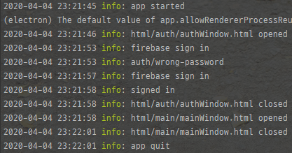

## [ARA]Winston 모듈을 이용해 logger 추가하기

언젠간 프로그램에 log를 남기는 기능을  넣어야겠다 생각하고 있었는데 다른 기능으로 넘어가기가 귀찮아서 쉬어가는 겸 logger를 추가하기로 했다.

electron의 경우 백엔드가 node.js로 작동하기 때문에 winston을 이용할 수 있었다.

~~~ javascript
const { createLogger, format, transports } = require('winston');
require('winston-daily-rotate-file');
const fs = require("fs");
const logDir = "./log";
const errLogDir = "./log/exception";

// 로그 폴더 없으면 새로 만들기
if(!fs.existsSync(logDir)) {
    fs.mkdirSync(logDir);
}

if(!fs.existsSync(errLogDir)) {
    fs.mkdirSync(errLogDir);
}

//logger 설정
exports.logger = new createLogger({
    transports: [
        new transports.Console({
            level: "debug",
            format: format.combine(
                format.timestamp({
                    format: "YYYY-MM-DD HH:mm:ss"
                }),
                format.colorize(),
                format.printf(info => `${info.timestamp} ${info.level}: ${info.message}`)
            )
        }),
        new transports.DailyRotateFile({
            level: "info",
            filename: `${logDir}/%DATE%-log.log`,
            datePattern: "YYYY-MM-DD",
            maxSize: "10m",
            maxFiles: "7d",
            format: format.combine(
                format.timestamp({
                    format: "YYYY-MM-DD HH:mm:ss"
                }),
                format.printf(info => `${info.timestamp} ${info.level}: ${info.message}`)
            )
        })
    ],
    exceptionHandlers: [
        new transports.DailyRotateFile({
            filename: `${errLogDir}/%DATE%-exception-log.log`,
            datePattern: "YYYY-MM-DD",
            maxSize: "10m",
            maxFiles: "7d"
        })
    ]
});
~~~

로그를 console과 파일에 작성하도록 transports를 설정하였고 console에 출력되는 로그의 경우 debug level까지 표시되도록 하였고 파일에는 info level까지만 표시되도록 설정하였다.

그리고 파일은 winston daily rotate file을 이용해서 날마다 새 파일을 생성하게 하였고 최대 7일까지 저장하도록 설정하였다.

파일은 root폴더 아래 log 폴더에 저장하였다.

그리고 exceptionHandler도 추가하였는데 이거는 log 폴더 아래 exception 폴더를 따로 더 만들어서 daily rotate file로 작성되도록 하였다.

그런데 exceptionHandler는 에러 출력 포맷이 적용이 안돼서 그냥 한 줄로 쭉 나오는 것 밖에 안 되더라...

logger는 따로 자바스크립트 폴더로 저장해서 export하고 각각 자바스크립트 파일에서 불러와 사용하도록 했다.

프로그램을 실행시키면 정상적으로 로그가 작성되기 시작한다.

처음에 winston을 적용시킬 때 구글에 나오는 블로그를 참고해서 적었었는데 옛날 버전 winston이라 그런지 에러가 났었다.

그냥 [Winston Github 페이지](https://github.com/winstonjs/winston)에 있는 Readme를 보고 설정하는게 제일 빠르고 정확하더라,
