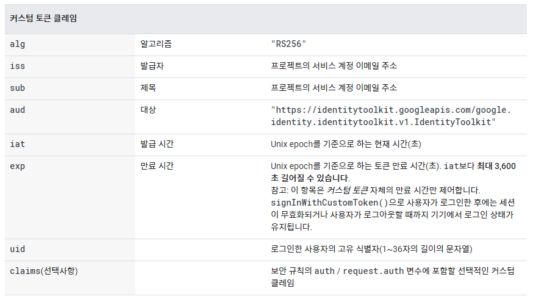
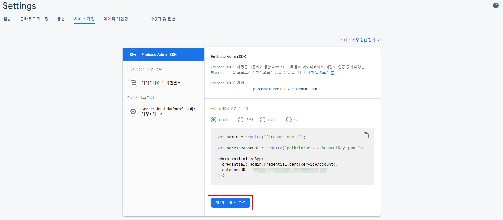
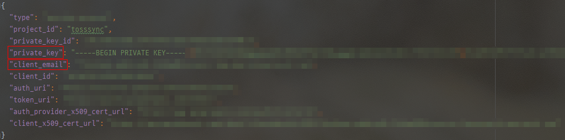
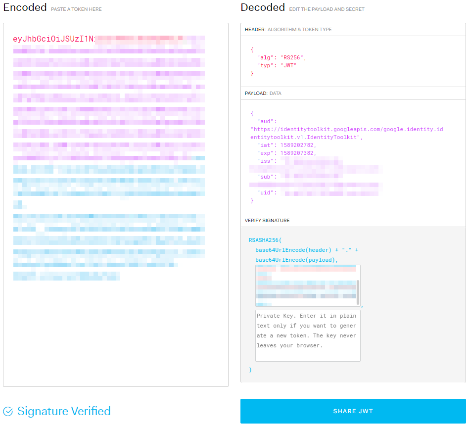
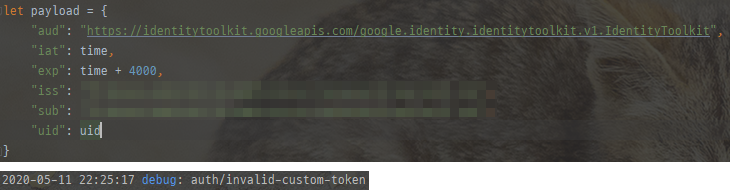

## [Firebase]Custom JWT로 Firebase 인증하기
ARA 클립보드 연동을 거의 다 끝내고 다음 기능으로 넘어가기 전에 개발하면서 매번 로그인하기도 귀찮고 언젠간 자동로그인을 구현해야 했기에 먼저 만들려고 시도를 하였다.

파이어베이스에서 custom JWT를 이용한 로그인이 가능하므로 JWT를 로컬에 저장해두고 이를 이용해 자동 로그인을 구현하려고 하였는데 결과부터 말하자면 실패다.

파이어베이스에서 사용 가능한 custom JWT는 유효시간이 최대 1시간 밖에 되지 않기 때문에 토큰을 발급 후 1시간이 지나면 그 토큰을 이용해 로그인을 할 수 없었다.

원래는 일주일 정도로 토큰 유효기간을 잡아서 그 기간 안에 다시 로그인을 하면 토큰을 재발급해 유효기간을 연장시키고, 그렇지 않으면 자동로그인이 풀리게 하려 했는데 유효시간이 최대 1시간 밖에 되지 않으니 이 방법을 이용해서는 불가능했다.

그래도 웹상에 파이어베이스 custom JWT관련 게시글이 없길래 기록이라도 남기기로 했다.

참고로 이 게시글은 firebase admin sdk에 있는 createCustomToken 함수를 이용한 custom JWT 발급 방법이 아닌 firebase admin sdk를 사용할 수 없는 환경에서 firebase 인증에 사용할 수 있는 JWT를 만드는 방법을 설명한 글이다.

우선 JWT에 대한 이해가 필요한데 [이 블로그](https://velopert.com/2389) 에 잘 정리가 되어 있다.

간단하게 정리만 해보자면 서버와 클라이언트 간에 통신하면서 쓸 정보를 암호화 토큰으로 만들어 넘겨주면 서버에서 검증하여 그 정보를 이용하는 것이라고 이해할 수 있을 것 같다. 

firebase에서 사용할 수 있는 토큰을 만들기 위해 [firebase API 문서](https://firebase.google.com/docs/auth/admin/create-custom-tokens?hl=ko) 를 참고하였고, JWT 발급을 위해 [Node jsonwebtoken](https://github.com/auth0/node-jsonwebtoken) 모듈을 이용하였다.

firebase 인증에 사용하는 JWT에는 payload가 다음과 같은 정보들을 가지고 있어야 하며, RSA256 암호화를 위한 비밀키 또한 필요하다.

위 정보들은 firebase project console에서 확인할 수 있는데 "프로젝트 설정 > 서비스 계정 > 새 비공개 키 생성"을 누르면 저장되는 json 파일에서 찾을 수 있다.

payload 속에 iss, sub는 client_email의 값을 넣어주면 되며 private_key는 곧 있으면 나올 해시 과정에 사용할 것이다.

~~~ javascript
let time = Math.floor(Date.now() / 1000);

let payload = {
    "aud": "https://identitytoolkit.googleapis.com/google.identity.identitytoolkit.v1.IdentityToolkit",
    "iat": time,
    "exp": time + 3600,
    "iss": "your service account",
    "sub": "your service account",
    "uid": firebase.auth().currentUser.uid
}
~~~

payload는 다음과 같이 딕셔너리를 이용해서 구성하면 되며 곡 들어가야 하는 정보인 iss, sub, aud, iat, exp, uid외에 개발자가 임의로 정한 claims 딕셔너리도 넣을 수 있다.

API 문서에서는 예시로 premium account인지 확인하는 claim을 추가했던데 나는 사용할 필요가 없어서 넣진 않았다.

그리고 javascript의 Date.now()함수는 밀리초를 포함한 UNIX 타임을 반환해주기 때문에 firebase에서 그대로 사용하면 invalid token 오류를 내기 때문에 밀리초는 떼줘야 한다. 

~~~ javascript
const jwt = require("jsonwebtoken");

let privateKey = "your private_key";

jwt.sign(payload, privateKey, {algorithm: 'RS256'}, (err, token) => {
    console.log(token);
});
~~~

payload를 저장하고 났으면 jsonwebtoken 모듈의 sign 함수를 이용해서 토큰 생성이 가능하다.

여기서 sign 함수의 두 번째 매개변수인 privateKey에는 방금 파이어베이스에서 받은 비공개 키 파일에 있는 privateKey를 이용해주면 된다.

jsonwebtoken 모듈 설명에 따르면 sign 함수의 callback 함수를 지정해주지 않으면 동기함수로 작동하고 지정해준다면 비동기 함수로 작동한다고 한다.

함수 실행 결과 다음과 같은 토큰이 나왔고 위 토큰을 [jwt.io](https://jwt.io) 에서 확인 해보면 다음과 같이 저장한 payload를 확인 할 수 있으며 signature 부분에 해시 과정에 사용한 private key를 넣어주면 signature verified 까지 확인이 가능하다.

이 토큰을 어딘가에 잘 저장해뒀다가 프로그램이 시작할 때 마다 다음처럼 토큰을 이용해 로그인을 하면 로그인이 가능하다.

~~~ javascript
const firebase = require("firebase/app");
require("firebase/auth");

firebase.auth().signInWithCustomToken(token).then(() => {
    console.log("sign in success");
}).catch(err => {
    console.log(err.code);
});
~~~

참고로 유효기간을 딱 한시간은 아니더라도 4000초? 정도 보다 더 길게 잡으면 invalid-custom-token 에러가 나온다...

아무래도 다른 방법을 찾아봐야 할 것 같다...

 
