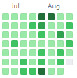
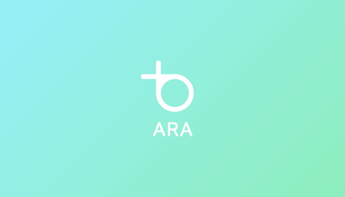
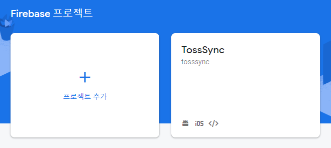
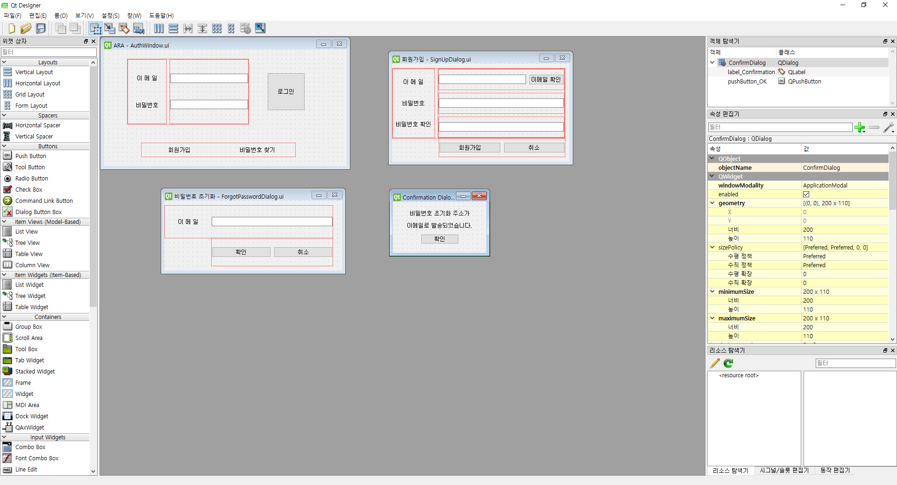
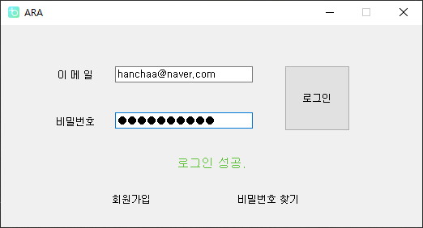
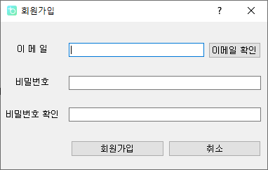
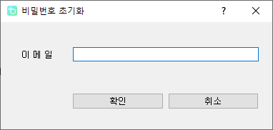
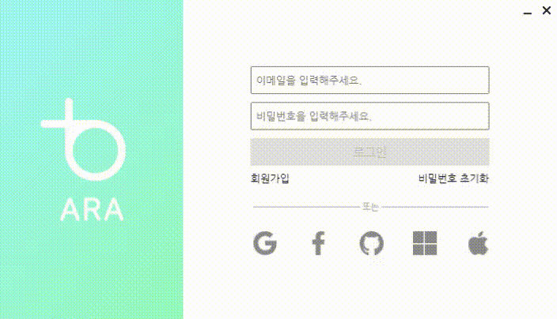
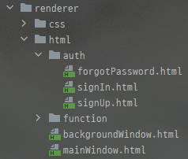

## [ARA]개발 중간 후기

거의 백만년 만의 블로그 글 작성인 것 같다.

그동안 아무것도 안한건 아니고 6월이 되면서 기말고사 준비를 하느라 좀 바빴고, 7월엔 UCPC 준비, 그 이후에는 계속 개발만 하다보니 블로그 생각을 못하고 있었다.

(중간 중간에 이상한 커밋이 껴 있긴 한데 6월 말부터 깃헙 잔디밭을 계속 키워 오고 있었다.)

오늘 글은 적은 이유는 계속 개발만 하고 문서로 안 남겨두면 나중엔 그 양이 어마어마해져서 끝까지 작성을 안 할 듯 해서 포트폴리오 정리겸 작성했다.

### 대체 뭐하는 프로젝트인가?

주변에서 보면 대체 뭐하는 프로젝트인지 궁금해 하는 사람이 꽤 있었는데, 대충 컨셉만 말하자면 여러가지 모바일 / 데스크탑 OS 간의 정보 동기화라고 보면 될 것 같다.

안드로이드(갤럭시만인가?) - 윈도우 / 맥 - ios의 연동의 느낌이랑 비슷하긴 한데 이 프로젝트는 OS 간의 제약이 없다.

물론 OS 간의 제약이 없다보니 특히 ios에서는 네이티브하게 작동을 구현하기는 힘들지만 어느정도는 기능이 잡혀가고 있다.

혼자서 모든 작업을 진행하고 있는 것은 아니고 3년 전 쯤 메이커 활동으로 드론을 만들면서 알게 된 동생과 함께 진행하고 있고, 그 친구는 모바일 앱을, 나는 데스크탑 앱을 구현 중이다.

프로젝트 구상은 그 친구가 하였고 이러이러한 프로젝트를 할거다 이야기 하길래 포트폴리오도 쌓을 겸 내가 데스크탑 앱을 만들어도 되겠냐고 제안을 했고, 어차피 혼자서 벅찼는데 잘 됐다면서 프로젝트에 합류하게 되었다.

여러 기기간의 동기화가 필요하니까 서버가 필요했고, 인원이 부족하다보니 백엔드를 담당할 사람이 없어 서버는 파이어베이스를 이용하기로 했다.

파이어베이스 콘솔에 나와있는 프로젝트 이름이 TossSync라고 되어 있는데 이건 개명 전 이름이다.

지금은 순우리말로 '바다'라는 뜻의 '아라'로 바꿨는데 지금 검색을 해보니까 '아라'도 '바다'의 순우리말이 맞다 아니다로 논쟁이 좀 있나보다.

백엔드에 관해서는 그렇게 할 말이 많지 않지만 프론트는 윤곽을 잡기 까지 좀 다사다난한 일이 있었다.

그동안 학교 수업이나 PS 대회를 참가하면서 콘솔 프로그램은 많이 작성해봤어도 GUI 프로그램은 처음 만들어보는지라 어떤 프레임워크를 쓸까 찾아보다가 PyQt를 이용했었다.

근데 이게 좀 이상한게 자료가 없어도 너무 없었다.

Qt 디자이너를 이요해서 레이아웃을 짜고 파이썬에서 불러와서 이벤트 리스너를 붙이는 식으로 작업을 했는데, 디자이너에서 각 오브젝트 적용할 수 있는 속성을 바꿔봐도 뭐가 다른건지도 모르겠고, 그렇다고 스택오버플로우나 이런 커뮤니티에 자료가 많은 것도 아니었다.

<table>
    <tr>
        <td valign="bottom"></td>
        <td valign="bottom"></td>
        <td valign="bottom"></td>
    </tr>
</table>

그래도 Qt에서 제공하는 공식 문서를 보면서 어찌저찌 유저 인증과 관련한 로직을 다 만들었다.

그러고 나서 다른 기능을 만들기 전에 로그인 창 디자인을 우선 했는데 디자인을 조금씩 하면서 점점 Qt가 뭔가 많이 부족하단 걸 느끼기 시작했다.

로그인 대기시간 동안 보여질 스피너나 로더를 넣을려고 했는데 [QML](https://ko.wikipedia.org/wiki/QML) 을 이용하면 넣을 수 있다고 해서 디자이너로 만들어둔 레이아웃 파일을 버리고 QML로 바꿨었다.

그렇게 또 QML로 열심히 디자인을 깎고 있는데 깔끔하게 만들기 위해서 프레임이 없는 디자인을 적용하니까 윈도우의 [Aero](https://ko.wikipedia.org/wiki/%EC%9C%88%EB%8F%84%EC%9A%B0_%EC%97%90%EC%96%B4%EB%A1%9C#%EC%9C%88%EB%8F%84%EC%9A%B0_7) 기능이 작동하지 않았고, 창 테두리에 그림자도 나오지 않아서 흰 배경 위에 있으면 프로그램의 경계가 보이지 않는 문제도 있었다.

그렇게 또 프레임워크 쇼핑을 시작했고 찾고 찾다가 [Electron](https://www.electronjs.org/) 을 찾았고 그렇게 웹 개발 아닌 웹 개발을 시작하게 되었다.

### 일렉트론으로 정착

현재는 로그인과 기기 간 클립보드 공유까지 작업을 끝내놨다.

사실 일렉트론으로 정착하고도 한 번 크게 갈아 엎은 적이 있는데, [이전 글](https://hanchaa.github.io/dev/firebase_custom_jwt) 에 이 일과 관련 된 내용이 적혀있다.

클립보드 공유 기능을 끝내고 메세지 기능으로 넘어가기 전에 자동 로그인 기능을 먼저 구현하려고 이것 저것 찾아봤는데, 이거 때문에 한 번 갈아 엎었다.

자바스크립트에서 사용 할 수 있는 firebase auth 모듈 자체에서 유저 인증 정보를 로컬에 유지 할지 또는 세션에서만 유지할지 정할 수 있는데 문제는 이게 Node.js 환경에서는 사용이 불가능했다.
 
일렉트론은 일단 크로미움 환경 웹브라우저에서 돌아가는 프로그램이다 보니까 백엔드랑 프론트엔드랑 나뉘어져 있는데 처음에 파이어베이스 모듈을 Node.js 환경인 백엔드에 사용을 해서 모두 구현을 해버린 것이다.

그래서 6월 말 종강 하자마자 백엔드에서 파이어베이스 모듈을 싹 걷어내고 프론트로 파이어베이스 모듈들을 옮겼다.

원래는 회원가입이나 비밀번호 초기화 창을 Modal window로 띄웠는데 SPA (Single Page Application)을 어디선가 봐서 "오 나도 한 번 해봐야지"라고 하면서 리액트를 시도했다가 욕만 하루종일 하고 원래 하던 대로 바닐라 js를 이용해 SPA를 구현했다.

### AJAX를 이용해 SPA 구현

보통 SPA를 구현한다고 하면 React나 Vue 같은 프레임워크를 쓰기 마련인데 러닝커브가 너무 커져서 그냥 바닐라 JS를 쭉 이용하기로 했다.

우선 다음과 같이 엔트리 포인트가 될 mainWindow.html 파일과 AJAX 통신을 이용해 mainWindow에서 갈아끼울 html 파일을 여러개 만들어두었다.

~~~ html
<!-- mainWindow.html --->
<body>
    <!-- 타이틀바 영역 --->
    

    <!-- 창 조작 버튼 영역 --->
    

      <button class="winBtn" id="minimize" tabindex="-1"></button>
      <button class="winBtn" id="close" tabindex="-1"></button>
    

    <!-- 로그인 화면 왼쪽 배너 영역 --->
    

      
      
      <button class="winBtn" id="bannerClose" tabindex="-1"></button>
    

    <!-- 회원가입 / 비밀번호 초기화 화면 영역 --->
    

    <!-- 로그인 / 기능 선택 화면 영역 --->
    

  </body>
~~~

모든 화면에서 공통적으로 사용되는 타이틀바라든지 창 조작 버튼 등을 mainWindow.html에 만들어두었고, 각각의 html 파일을 불러와서 otherWin / mainWin div에 갈아끼우는 방식으로 SPA를 구현하였다.

~~~ javascript
requestSignIn = async filePath => {
    let response = await fetch(filePath);

    if (response.status !== 200) {
        logger.error("local/sign-in-load-error");
        logger.error(`local/${response.statusText}`);

        return;
    }

    document.querySelector("#mainWin").innerHTML = await response.text();
    logger.info(`${filePath} loaded`);

    // 저장된 이메일이 있을 경우 자동 완성
    let email = store.get("email");
    if (email !== undefined) {
        document.querySelector("#email").value = store.get("email");
        document.querySelector("#password").focus();
    }

    else
        document.querySelector("#email").focus();

    // 모든 text input에 이벤트 연결
    document.querySelectorAll("input").forEach(element => {
        element.addEventListener("input", textChanged);
        element.addEventListener("keypress", enterPressed);
    });

    document.querySelector("#signIn").addEventListener("click", signInClicked);
    document.querySelector("#emailResend").addEventListener("click", emailResend);

    // 회원가입, 비밀번호 초기화 텍스트 버튼 이벤트리스너 연결
    document.querySelector("#signUp").addEventListener("mousedown", subMenuClicked);
    document.querySelector("#signUp").addEventListener("click", () => requestSignUp(path.join(__dirname, "../../html/auth/signUp.html")));
    document.querySelector("#forgotPassword").addEventListener("mousedown", subMenuClicked);
    document.querySelector("#forgotPassword").addEventListener("click", () => requestResetPassword(path.join(__dirname, "../../html/auth/forgotPassword.html")));
}
~~~

signIn.html을 불러와서 mainwin div의 innerHTML을 바꾸는 함수이다.

filePath를 매개변수로 받아서 fetch 함수를 이용해 html 파일을 불러오면 mainWin div의 innerHTML에 그대로 채워넣어주는 것 뿐이다.

새로운 요소들을 채워넣은 후 필요한 이벤트 리스너들을 밑에서 모두 연결 해주면 바닐라 JS에서도 손 쉽게 SPA를 구현할 수 있었다.

이 화면이 사라질 때 이벤트 리스너들을 따로 다 지우지는 않았는데 IE 말고는 가비지 컬렉터가 알아서 메모리를 정리한다고 해서 그대로 두었다.

다른 기능을 하는 화면들도 이와 똑같은 방식으로 구현을 했다.

이 외에도 클립보드 구현, 백그라운드 구현 이야기도 더 해야 하는데 글이 길어져서 나중에 또 적어야겠다.

적어도 한달에 한번은 월말 후기를 적어야 하려나...
