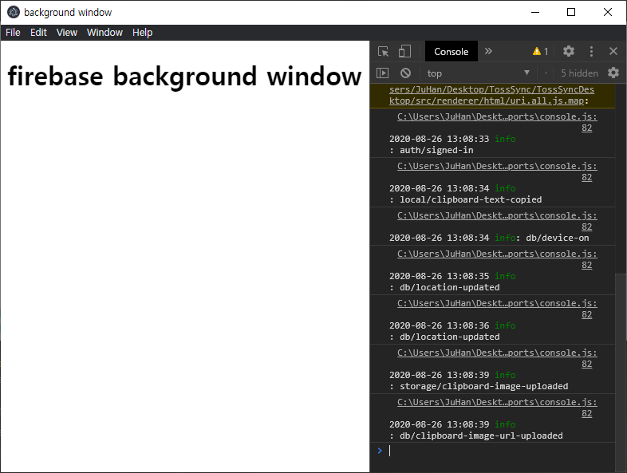
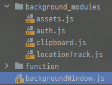

## [ARA]백그라운드 페이지 제작

프로그램이 실시간 연동이 필요하다 보니 백그라운드 프로세스도 당연히 필요했다.

처음에는 일렉트론의 백엔드인 Node.js 환경에서 파이어베이스를 이용하고 모든 창이 꺼져도 앱은 꺼지지 않게 하려고 했었지만 이전 글에 나왔 듯이 Node.js 환경에서는 파이어베이스 자동 로그인이 불가능해서 자바스크립트 환경인 프론트 엔드에서 파이어베이스를 사용해야 했다.

그래서 SPA로 구현한 메인화면에서 파이어베이스를 사용하고, 메인화면의 닫기 버튼을 누르면 닫는게 아닌 숨김 처리를 했었다.

근데 이게 또 Alt + F4나 작업표시줄에서 닫기 버튼을 누르면 창이 꺼졌고, 이걸 다시 켜지게 구현을 하면 꺼졌다가 다시 켜지는 사이에 공백이 생기고 매번 다시 로그인이 되는 문제가 있었다.

그래서 위 사진과 같은 파이어베이스 전용 창을 하나 만들어서 거기서 모든 파이어베이스와 관련된 통신을 담당하게 했다.

~~~javascript
createBackground = () => {
    return new Promise(resolve => {
        let filePath = path.join(__dirname, "../../renderer/html/backgroundWindow.html");
        logger.info(`${filePath} loaded`);

        windows["background"] = new BrowserWindow({
            width: 800,
            height: 600,
            webPreferences: {
                nodeIntegration: true,
                enableRemoteModule: true,
                devTools: isDev,
            },
            show: isDev,
        });

        windows["background"].webContents.openDevTools();
        windows["background"].loadFile(filePath).catch(() => logger.info(`${filePath} load failed`));

        windows["background"].once("closed", () => {
            logger.info(`${filePath} closed`);

            app.quit(); // 백그라운드 프로세스 종료시 앱 종료
        });

        resolve();
    });
}

app.whenReady().then(async () => {
    logger.info("app started");

    createTray();
    await createBackground(); // 백그라운드 프로세스 로딩 끝날 때 까지 대기
    createMainWindow();
});
~~~

우선 백그라운드 창을 만드는 함수를 만들었는데 백그라운드가 만들어진 후 메인 화면이 만들어지게 하기 위해 createBackground 함수는 Pormise를 리턴하게 하였다.

그리고 [electron-is-dev](https://www.npmjs.com/package/electron-is-dev) 라는 모듈이 있어서 개발 중일 때는 백그라운드 창이 보이고 빌드한 결과물에서는 알아서 숨겨지도록 할 수 있었다.

또 작업관리자 등으로 유저가 백그라운드 창을 실수로 닫아버릴 수도 있으니 백그라운드 창이 꺼지면 앱 자체가 종료되도록 하였다.

위와 같이 백그라운드에 사용되는 스크립트들은 모듈화를 하였고

~~~ javascript
// 유저에게 보여지는 화면에서 사용되는 스크립트의 코드 중 일부
ipcRenderer.sendTo(windows.background.webContents.id, "signIn", email.value, password.value);

ipcRenderer.on("signInResult", (e, result) => {
    ...
});

// auth.js
ipcRenderer.on("signIn", async (e, email, password) => {
    let result = undefined;

    await firebase.auth().signInWithEmailAndPassword(email, password).then(() => {
        if (firebase.auth().currentUser.emailVerified === false)
            result = "auth/email-not-verified";
        else
            // 로그인 성공 시 이메일 저장
            store.set("email", firebase.auth().currentUser.email);
    }).catch(error => result = error.code);

    // 로그인 결과 회신
    ipcRenderer.sendTo(e.senderId, "signInResult", result);
});
~~~

다음과 같이 ipc통신을 이용해서 백그라운드 창으로 필요한 정보를 보내면 처리 후 다시 답장을 보내도록 하였다.

일렉트론에서 지원하는 유용한 모듈 중에 [remote.require](https://www.electronjs.org/docs/api/remote#remoterequiremodule) 가 있는데 일렉트론의 main 프로세스에서 사용되는 모듈을 renderer 프로세스에서도 그대로 사용할 수 있게 해준다.

~~~ javascript
exports.windows = {
    main: null,
    background: null,
    clipboard: null
}

exports.windows["background"] = new BrowserWindow({...});
~~~

BrowserWindow를 모두 main 프로세스에서 생성하게 하고 windows라는 객체에 BrowserWindow 객체를 모두 저장해둔 뒤 renderer에서 불러오면 renderer에서도 현재 생성되어 있는 창에 바로 접근이 가능하다.

이를 이용해서 백그라운드 창의 webContents id를 불러와서 ipcMain을 거치지 않고 바로 백그라운드 창으로 ipc통신을 보낼 수 있었다.
